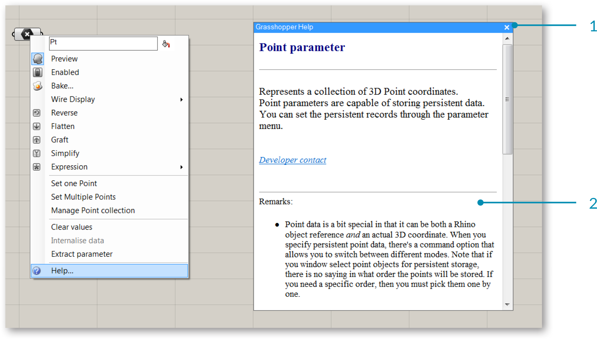

### 1.2.2. ЧАСТИ КОМПОНЕНТА GRASSHOPPER

#####Компоненты - это объекты, которые размещают на холсте и соединяют друг с другом связями, чтобы создать визуальную программу. Компоненты могут представлять Rhino геометрию или такие операции как Math Functions. У компонентов имеются входы и выходы.

>1. Три параметра ввода компонента Circle CNR.
2. Область компонента Circle CNR.
3. Параметр выхода компонента Circle CNR.

Компоненту требуются данные, чтобы выполнить действие и достигнуть результата. Поэтому, большинство компонентов имеют ряд встроенных параметров, которые обозначаются как Вход и Выход, соответственно. Входные параметры расположены слева, параметры выхода справа.

Ниже приведены несколько компонентов Grasshopper, которые имеют входы, но не имеют выходов, либо наоборот. Если у компонента нет входов или выходов, то у него будет зазубренный край.

####1.2.2.1. ОТОБРАЖЕНИЕ ЛЕЙБЛОВ И ИКОНОК
У каждого объекта Grasshopper уникальная иконка. Эти иконки располагаются в центральной области объекта и соответствуют иконкам, расположенным на Палитре Компонентов. Объекты также могут отображаться в виде текстовых ярлыков. Чтобы переключиться между отображением в виде иконки и ярлыка, выберите Draw Icons в меню Display. Вы также можете выбрать Draw Full Names, чтобы отобразить полное имя каждого объекта, а также его входы и выходы.

>1. Переключение отображения в виде иконки и ярлыка.
2. Отобразить полное имя компонента и его входы и выходы.

>1. Компонент Circle CNR - отображение ярлыка
2. Компонент Circle CNR - отображение иконки
3. Компонент Circle CNR с отображением полных наименований

Мы рекомендуем использовать вид иконки, чтобы познакомиться с иконками компонентов, так чтобы вы могли быстро находить их на палитрах. Это также позволит вам с первого взгляда понимать определение. Текстовые ярлыки могут сбивать с толку из-за того, что различные компоненты могут иметь одинаковые ярлыки.

>У Circle CNR и Circle 3pt одинаковые ярлыки, но различные иконки.

Чтобы обнаружить расположение компонентов на панелях зажмите Ctrl + Alt и кликните на существующий компонент на холсте. Так вы обнаружите компонент на палитре.

####1.2.2.2. ПОМОЩЬ ПО КОМПОНЕНТАМ
Кликните правой клавишей мыши по объекту и выберите "Help" из выпадающего меню, чтобы открыть справочное окно Grasshopper. Справочное окно содержит более подробное описание объекта, список вводов и выводов и замечания.

>1. Справочное окно Grasshopper для параметра Point.
2. Замечания в справочном окне дают дополнительные сведения о параметре Point.

####1.2.2.3. ПОДСКАЗКИ ПО ИНСТРУМЕНТАМ
Входы компонента ожидают получения определенного типа данных, например, компонент может показывать, что вы должны подсоединить точку или плоскость к его входу. При наведении мышки на отдельные части компонента, вы увидите разные подсказки, которые отображают определенный тип объекта, находящийся под мышкой. Подсказки довольно информативны, так как они сообщают тип и данные индивидуальных параметров.

>1. Заголовок подсказки показывает иконку типа входа, название компонента, ярлык для входа и тип входа в текстовом виде.
2. Описание простым языком того, какой вход для компонента.
3. Любые значения определенные для входа - либо локальные либо из подключенных связей.
4. Заголовок выхода подсказки по инструментам предоставляет те же самые данные как для входов, но для соответствующего выхода.
5. Результат действий компонента.

####1.2.2.4. КОНТЕКСТНЫЕ ВЫПАДАЮЩИЕ МЕНЮ
Все объекты на холсте имеют свое контекстное меню, которое раскрывает их настройки и подробные данные. Кликните правой клавишей мыши по центру компонента, и вы вызовете контекстное меню. И вход, и выход имеют свои контекстные меню, которые можно посмотреть тем же способом.

>1. Контекстное меню компонента.
2. Редактируемое текстовое поле, которое отображает имя объекта.
3. Значок предпросмотра - сообщает о том, будет ли геометрия, произведенная этим объектом, видна в видовом окне Rhino. Отключение предпросмотра ускорит скорость работы видового окна Rhino и время, затраченное на решение.
4. Предупреждение о времени выполнения задания - представляет предупреждения о том, что то-то затрудняет работу компонента.

>1. Контекстное меню входа С.
2. Установите одну или несколько точек - позволяет вам выбрать исходную геометрию в видовом окне Rhino.
3. Manage Point collection (управление набором точек) - открывает диалоговое окно, в котором вы можете добавлять или удалять точки из набора точек и просматривать информацию о каждой точке.
4. Добавить элемент в набор.
5. Удалить выбранное.

####1.2.2.5. МАСШТАБИРУЕМЫЙ ПОЛЬЗОВАТЕЛЬСКИЙ ИНТЕРФЕЙС
У некоторых компонентов может быть увеличено число входов или выходов посредством Масштабируемого Пользовательского Интерфейса (ZUI). Увеличивая компонент на холсте, появится дополнительный набор опций, которые позволят вам добавить или удалить входы или выходы у данного компонента. Компонент Addition позволяет вам добавлять входы, предоставляя дополнительные элементы для дополнительных операций.

>1. Кликнуть + знак, чтобы добавить Вход.
2. Кликнуть - знак, чтобы удалить Вход.

Компонент panel (панель) также имеет масштабируемый UI. Он представляет собой самоклеющийся стикер. Благодаря этому вы можете добавлять небольшие заметки или объяснения к определению. Вы можете менять текст через меню или двойным кликом на поверхности панели. Панели могут получать и отображать информацию, откуда угодно. Если вы подключите выход в панель, вы увидите содержание этого параметра в реальном времени. Все данные в Grasshopper можно просматривать таким образом. При приближении панели появится меню, в котором вы сможете поменять фон, шрифт и другие характеристики. Эти опции становятся также доступны, если кликнуть правой клавишей мыши по панели

>1. Подвигайте ползунки, чтобы настроить поля панели.
2. Увеличить или уменьшить размер шрифта содержимого панели.
3. Измените выравнивание содержания панели.
4. Выберите размер содержания панели.
5. Выберите цвет фона панели. Вы можете установить новый цвет по умолчанию для ваших панелей, кликнув правой клавишей мышки и выбрав "Set Default Color".

