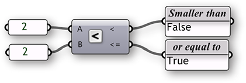
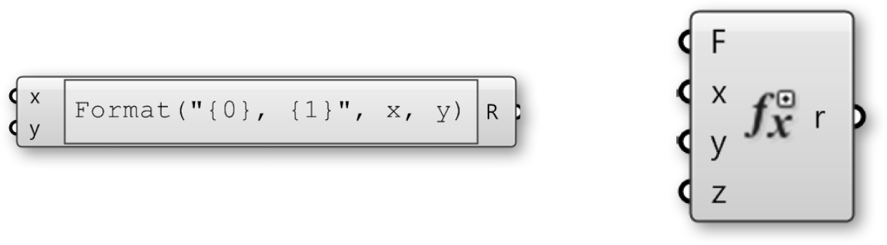

### 1.3.3. Математика, Выражения и Условия

>Файлы упражнения, которые сопровождают этот раздел: [http://grasshopperprimer.com/appendix/A-2/1_gh-files.html](http://grasshopperprimer.com/appendix/A-2/1_gh-files.html)

>Файлы упражнения, которые сопровождают этот раздел: [Download](../../appendix/A-2/gh-files/1.3.3_operators and conditionals.gh)


#####Знание как работать с числовыми данными - необходимый навык при изучении использования Grasshopper. Grasshopper содержит много компонентов для выполнения математических операций, определения условий и управления числовыми множествами.

В математике, числа организуются в множества и с двумя из них вы, возможно, знакомы:

Целые числа: […, -5, -4, -3, -2, -1, 0, 1, 2, 3, 4, 5, …]<br>
Числа с плавающей точкой: [8, …, -4.8, -3.6, -2.4, -1.2, 0.0, 1.234, e, 3.0, 4.0, …, 8]

Несмотря на то, что существуют и другие типы числовых множеств, эти два интересует нас больше всего, потому что они активно используются в Grasshopper. Хотя существуют и ограничения в точном представлении этих множеств в цифровой среде, мы можем аппроксимировать их с высокой степенью точности. В дополнение, следует понимать, что различие между Целыми числами и Числами с плавающей точкой соответствует различию между дискретными и непрерывными диапазонами. В этой главе, мы собираемся исследовать различные методы работы и определения различных числовых множеств.

####1.3.3.1. ВКЛАДКА MATHS
Большинство компонентов, работающих с математическими операциями и функциями, располагаются во вкладке Math:


>1. Диапазоны используются для определения диапазонов значений (ранее назывались интервалами) между двумя числами. Компоненты в свитке Domain позволяют вам создавать или разрушать различные типы диапазонов.
2. В математике, матрица - это массив чисел, организованных в ряды и колонки. Этот свиток содержит набор инструментов для создания и изменения матриц.
3. Operators (Операторы) используются для выполнения математических операций, таких как Сложение, Вычитание, Умножение и т.д. Условные операторы позволяют вам определить, является ли числовое множество больше чем, меньше чем или равным другому числовому множеству.
4. Polynomials (Многочлены) - одна из самых важных идей в алгебре и во всей математике и науке. Вы можете использовать компоненты из этого свитка для вычисления факториалов, логарифмов или для возведения числа в n-ую степень.
5. Свиток Script содержит одно- и многозначные выражения, а также компоненты скриптов VB.NET и C#.
6. Эти компоненты позволяют решить тригонометрические функции, такие как Синус, Косинус, Тангенс и др.
7. Свиток Time включает набор компонентов, которые позволяют создавать примеры даты и времени.
8. Свиток Utility - это 'мешок' с полезными компонентами, которые можно использовать в различных математических уравнениях. Зайдите сюда, если вы пытаетесь найти максимальные и минимальные значения двух списков чисел; или среднее в группе чисел.

####1.3.3.2. ОПЕРАТОРЫ
Как было указано ранее, операторы - это наборы компонентов,
которые используют алгебраические функции с двумя числовыми 
значениями входа, которые дают одно значение выхода.

Большую часть времени, вы будете использовать Математические операторы
(Math) для совершения арифметических действий с числовыми множествами.
Тем не менее, эти операторы могут также использоваться для различных 
типов данных, включая точки и векторы.


####1.3.3.3. УСЛОВНЫЕ ОПЕРАТОРЫ
Почти каждый язык программирования имеет метод определения условных выражений. 
В большинстве случаев, программист создает части кода, чтобы задать простой 
вопрос "Что если". Что если область контура пола превышает программные требования? 
Или, что если изгиб моей крыши превышает реальные данные? Эти важные вопросы
представляют высокий уровень абстрактного мышления. Компьютерные программы 
способны анализировать вопросы "что если" и действовать в зависимости от ответа
на этот вопрос. Давайте посмотрим на очень простое условное выражение, которое 
программа может понять: Если объект - кривая, удалить его. Часть кода сначала 
смотрит на объект и определяет единичные булевые значения для решения кривая 
это или нет. Среднего здесь не дано. Булевое значения равно True (правда), если
объект - это кривая, или False (Ложь), если объект не кривая. Вторая часть
утверждения выполняет действие в зависимости от результата условного утверждения;
в этом случае, если объект - это кривая, то решение - удалить ее. Это условное
утверждение называется If (Если) утверждение. Существуют четыре условных оператора 
(располагаются во вкладке Math/ свиток Operators), которые определяют условие 
и выдают булевое значение.

Компонент Equality (равенство) берет два списка и сравнивает первый элемент списка А
с первым элементом списка Б. Если два значения одинаковые, тогда создается булевое 
значение True, напротив, если два значения неравные, тогда создается булевое значение 
False. Компонент повторяет этот процесс со списками в соответствии с заданными 
алгоритмами совпадения (по умолчанию устанавливается самый длинный список). У этого 
компонента имеются два выхода. Первый возвращает список булевых значений, который
показывает, какие из значений в списке были равны другим значениям. Второй выход
возвращает список, который показывает, какие значения не были равны другим, либо
список, который получается из первого выхода.


Компонент Similarity (сходство) оценивает два списка данных и тестирует сходство
между двумя числами. На деле, это очень похоже на способ работы компонента Equality,
который сравнивает два списка, за одним исключением: у него есть вход для процентов,
который определяет степень списка А, которую список Б может исказить до того как 
неравенство будет определено. Компонент Similarity также имеет выход, который 
определяет абсолютное значение расстояния между двумя входными списками.


Компонент Larger Than берет два списка данных и определяет, больше ли первый 
элемент списка А, чем первый элемент списка Б. Два выхода позволяют вам 
определить, хотите ли вы определить два списка в соответствии с условием больше
чем (>) или больше чем и равняется (>=).


Компонент Smaller Than выполняет противоположное действие компонента Larger Than.
Компонент Smaller Than определяет, если список А меньше, чем список Б и возвращает
список булевых значений. Схоже, два выхода позволяют определить вам, хотели бы
вы определить каждый список в соответствии с условием меньше чем (<) или меньше
чем и равно (<=).



####1.3.3.4. ТРИГОНОМЕТРИЧЕСКИЕ КОМПОНЕНТЫ

>Файлы упражнения, которые сопровождают этот раздел: [http://grasshopperprimer.com/appendix/A-2/1_gh-files.html](http://grasshopperprimer.com/appendix/A-2/1_gh-files.html)

>Файлы упражнения, которые сопровождают этот раздел: [Download](../../appendix/A-2/gh-files/1.3.3.4_trigonometry components.gh)


Мы уже показали, что мы можем использовать компонент Expression 
(или Evaluate) для определения условных выражений, а также для 
вычисления алгебраических уравнений. Тем не менее, существуют 
другие способы вычисления простых выражений, используя несколько
встроенных Тригонометрических функций. Мы может использовать эти
функций для определения периодического феномена как синусоидальная
волновая форма, например, волны океана, звуковые волны и световые волны.


>1. Линия<br>
```y(t) = 0```
2. Синусная кривая<br>
```y(t) = sin(t)```
3. Винтовая спираль<br>
```x(t) = cos(t)```<br>
```y(t) = sin(t)```<br>
```z(t) = b(t)```
4. Спираль<br>
```x(t) = t*cos(t)```<br>
```y(t) = t*cos(t)```

В этом примере, мы будем использовать Grasshopper для создания различных тригонометрических
кривых, используя компоненты тригонометрических функций из раздела Math:

<style>
td:nth-child(1) {color: #008DB2}
td:nth-child(3)	{width: 15%}
td {background-color: #F9F9F9}
thead {display: none}
</style>

||||
|--|--|--|
|01.| Чтобы начать новое определение, нажмите Ctrl+N в Grasshopper||
|02.| Зайдите в **Params/Geometry/Point** – Drag and drop a **Point** parameter  onto the canvas|[](../../appendix/A-1/0_index-of-components.html#PGPt)|
|03.| Right click the **Point** parameter and click Set One Point – select a point in the Rhino viewport||
|04.| **Vector/Vector/Unit X** – Drag and drop the **Unit X** component to the canvas|[](../../appendix/A-1/0_index-of-components.html#VVX)|
|05.| **Params/Input/Number Slider** – Drag and drop the **Number Slider** component  onto the canvas|[](../../appendix/A-1/0_index-of-components.html#PISlider)|
|06.| Double-click on the **Number Slider** and set the following:<ul>Rounding: Integer<br>Lower Limit: 10<br>Upper Limit: 40<br>Value: 20</ul>||
|07.|** Transform/Array/Linear Array** – Drag and drop the **Linear Array** component onto the canvas|[](../../appendix/A-1/0_index-of-components.html#TAArrLinear)|
|08.| Connect the output of the **Point** parameter to the Geometry (G) input of the **Linear Array** component||
|09.| Connect the Unit Vector (V) output of the **Unit X** component to the Direction (D) input of the **Linear Array** component<br><blockquote>You should see a line of 20 points along the x axis in Rhino. Adjust the slider to change the number of points in the array.</blockquote>||
|10.| Connect the **Number Slider** output to the Count (N) input of the **Linear Array** Component||
|11.| **Curve/Spline/Interpolate** – Drag and drop the **Interpolate Curve** component to the canvas|[](../../appendix/A-1/0_index-of-components.html#CSIntCrv)|
|12.| Connect the Geometry (G) output of the **Linear Array** component to the Vertices (V) input of the **Interpolate Curve** component|||


>We have just created a line by connecting an array of points with a curve. Let’s try using some of Grasshopper’s Trigonometry components to alter this curve:

||||
|--|--|--|
|13.| **Vector/Point/Deconstruct** – Drag and drop a **Deconstruct** component onto the canvas|[](../../appendix/A-1/0_index-of-components.html#VPpDecon)|
|14.| **Vector/Point/Construct Point** - Drag and drop a **Construct Point** component onto the canvas|[](../../appendix/A-1/0_index-of-components.html#VPPt)|
|15.| **Maths/Trig/Sine** - Drag and drop a **Sine** component onto the canvas|[](../../appendix/A-1/0_index-of-components.html#MTSin)|
|16.| Disconnect the wire from the Vertices (V) input of the **Interpolate Curve** component.<br><blockquote>You can disconnect wires by holding down control and dragging, or by right-clicking the input and selecting Disconnect</blockquote>||
|17.| Connect the Geometry (G) output of the **Linear Array** component to the Point (P) input of the **Deconstruct** component||
|18.| Connect the Point X (X) output of the **Deconstruct** component to the X coordinate (X) input of the **Construct Point** Component||
|19.| Connect a second wire from the Point X (X) output of the **Deconstruct** Component to the Value (x) input of the **Sine** component||
|20.| Connect the Result (y) output of the **Sine** component to the Y coordinate (Y) input of the **Construct Point** component<br><blockquote>We have now reconstructed our points with the same X values, modifying the Y values with a sine curve.</blockquote>||
|21.| Connect the Point (Pt) output of the **Construct Point** component to the Vertices (V) input of the **Interpolate** component|||

</li><br>
>You should now see a sine wave curve along the X axis in Rhino

||||
|--|--|--|
|22.| **Maths/Trig/Cosine** – Drag and drop a **Cosine** component to the canvas|[](../../appendix/A-1/0_index-of-components.html#MTCos)|
|23.| Connect a third wire from the Point X (X) output of the **Deconstruct** Component to the Value (x) input of the **Cosine** component||
|24.| Connect the Result (y) output of the **Cosine** component to the Z coordinate (Z) input of the **Construct Point** component|||

</li><br>
>We have now created a 3D helix

||||
|--|--|--|
|25.| **Maths/Operators/Multiplication** – Drag and drop two **Multiplication** components onto the canvas|[](../../appendix/A-1/0_index-of-components.html#MOMultiply)|
|26.| Connect wires from the Point X (X) output of the **Deconstruct** component to the (A) input of each **Multiplication** component||
|27.| Connect the Result (y) output of the **Sine** component to the (B) input of the first **Multiplication** component||
|28.| Connect the Result (y) output of the **Cosine** component to the (B) input of the second **Multiplication** component||
|29.| Disconnect the wire from the Y Coordinate (Y) input of the **Construct Point** component||
|30.| Connect the Result (R) output of the first **Multiplication** component to the X Coordinate (X) input of the **Construct Point** component||
|31.| Connect the Result (R) output of the second **Multiplication** component to the Z Coordinate (Z) input of the **Construct Point** component|||


>You should now see a spiral curve


####1.3.3.5. EXPRESSIONS

>Example files that accompany this section: [http://grasshopperprimer.com/appendix/A-2/1_gh-files.html](http://grasshopperprimer.com/appendix/A-2/1_gh-files.html)

>Example files that accompany this section: [Download](../../appendix/A-2/gh-files/1.3.3.5_expressions.gh)


The Expression component (and its brother the Evaluate component) are
very flexible tools; that is to say that they can be used for a variety of different
applications. We can use an Expression (or Evaluate component) to solve
mathematical algorithms and return numeric data as the output.



In the following example, we will look at mathematical spirals found in nature
and how we can use a few Functions components to create similar patterns in
Grasshopper. We will build on our trigonometric curves definition as a starting
point.


||||
|--|--|--|
|01.| Open your Trigonometric curves Grasshopper definition from the previous example||
|02.| Delete the **Sine**, **Cosine**, **Multiplication**, and **Interpolate** components||
|03.| **Params/Input/Number Slider** – Drag and drop a Number Slider onto the canvas||
|04.| Double-click on the **Number Slider** and set the following:<ul>Rounding: Float<br>Lower Limit: 0.000<br>Upper Limit: 1.000<br>Value: 1.000</ul>||
|05.| Connect the **Number Slider** to the Factor (F) input of the Unit X component.<br><blockquote>This slider allows you to adjust the distance between the points in the array.</blockquote>||
|06.| **Maths/Script/Expression** – Drag two **Expression** components onto the canvas|[](../../appendix/A-1/0_index-of-components.html#MSExpression)|
|07.| Double-click the first **Expression** component to open the Expression Editor and change the expression to: ```x*sin(x)```||
|08.| Double-click the second **Expression** component to open the Expression Editor and change the expression to: ```x*cos(x)```|||


>Double click the Expression component to open the Grasshopper Expression Editor

||||
|--|--|--|
|09.| Connect two wires from the Point X (X) output of the **Deconstruct** component to the Variable x (x) input of each **Expression** component||
|10.| Connect the Result (R) output of the first **Expression** component to the X coordinate (X) input of the **Construct Point** component||
|11.| Connect the Result (R) output of the second **Expression** component to the Y coordinate (Y) input of the **Construct Point** component<br><blockquote>We have replaced the Trigonometry functions and multiplication operators with the expression components for a more efficient definition.</blockquote>||
|12.| **Mesh/Triangulation/Voronoi** – Drag and drop the **Voronoi** component  onto the canvas|[](../../appendix/A-1/0_index-of-components.html#MTVoronoi)|
|13.| **Params/Input/Number Slider** – Drag and drop a **Number Slider** onto the canvas||
|14.| Double-click on the **Number Slider** and set the following:<ul>Rounding: Integer<br>Lower Limit: 1<br>Upper Limit: 30<br>Value: 30</ul>||
|15.| Connect the **Number Slider** to the Radius (R) input of the **Voronoi** component||
|16.| Connect the Point (Pt) output of the **Construct Point** component to the Points (P) input of the **Voronoi** component|||


You can create different Voronoi patterns by manipulating the Factor, Count, and Radius sliders. Below are three examples:


>1. Factor = 1.000, Radius = 15
2. Factor = 0.400, Radius = 10
3. Factor = 0.200, Radius = 7

---

