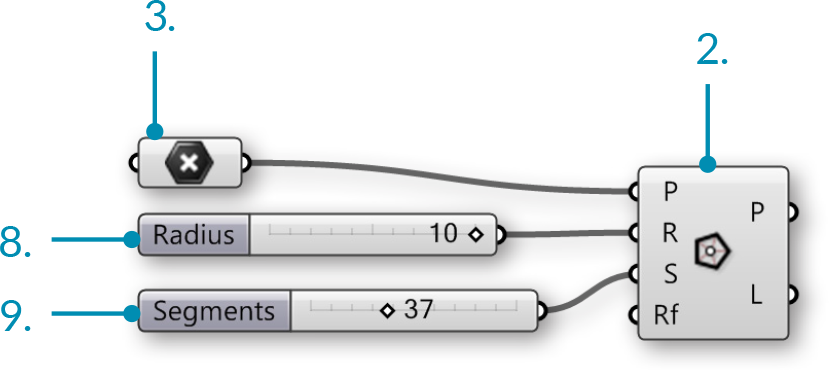

### 1.3.4. Диапазоны и Цвета


>Файлы упражнения, которые сопровождают этот раздел: [http://grasshopperprimer.com/appendix/A-2/1_gh-files.html](http://grasshopperprimer.com/appendix/A-2/1_gh-files.html)

>Файлы упражнения, которые сопровождают этот раздел: [Download](../../appendix/A-2/gh-files/1.3.4_domains and color.gh)


##### Цветовое круг - это модель организации цветов, основанная на их тоне. В Grasshopper цвета могут определяться по значению их тона в диапазоне от 0.0 до 1.0. Диапазоны используются для определения диапазона всех возможных значений между числовым набором и нижней границей (А) и верхней границев (В).

>В цветовом круге, тон соответствует углу. Grasshopper взял эти 0-360 диапазоны и перенес их на значения от нуля до единицы.

Разделив диапазон Тона (0.0 - 1.0) на желаемое число сегментов, мы можем назначить значение тона для каждого сегмента, чтобы создать цветовой круг.

В этом примере, вы будем использовать домены Grasshopper и цветовые компоненты, чтобы создать цветовой круг с различным числом сегментов.

||||
|--|--|--|
|01.| Чтобы начать новое определение, нажмите Ctrl+N в Grasshopper||
|02.| Зайдите в **Curve/Primitive/Polygon** – перетащите компонент **Polygon** на холст||
|03.| Зайдите в **Params/Geometry/Point** – перетащите параметр **Point** на холст||
|04.| Кликните правой клавишей мыши по компоненту **Point** и выберите set one point||
|05.| Назначьте точку в пространстве модели.||
|06.| Соедините параметр **Point** (Base Point) с входом Plane (P) компонента **Polygon**||
|07.| Зайдите в **Params/Input/Number Sliders** – перетащите два слайдера **Number Sliders** на холст||
|08.| Дважды кликните по первому слайдеру **Number Sliders** и установите следующее:<ul>Rounding: Integers Lower Limit: 0 Upper Limit: 10 Value: 10</ul>||
|09.| Дважды кликните по второму слайдеру **Number Sliders** и установите следующее:<ul>Rounding: Integers Lower Limit: 0 Upper Limit: 100 Value: 37</ul>||
|10.| Соедините **Number Slider** (Radius) с входом Radius (R) компонента **Polygon** <blockquote>При подсоединении слайдера к компоненту, автоматически изменится его имя на имя входа, к которому он подсоединен.</blockquote>||
|11.| Соедините **Number Slider** (Segments) с входом Segments (S) компонента **Polygon**|||

||||
|--|--|--|
|12.| Зайдите в **Curve/Util/Explode** – перетащите компонент **Explode** на холст.||
|13.| Соедините выход Polygon (P) компонента **Polygon** с входом Curve (C) компонента **Explode**||
|14.| Зайдите в **Surface/Freeform/Extrude Point** – перетащите компонент **Extrude Point** на холст||
|15.| Соедините выход Segments (S) компонента **Explode** с входом Base (B) компонента **Extrude Point**||
|16.| Соедините параметр **Point** (Base Point) со входом Extrusion Tip (P) компонента **Extrude Point**||
|17.| Зайдите в **Surface/Analysis/Deconstruct Brep** – перетащите компонент **Deconstruct Brep** на холст||
|18.| Соедините выход Extrusion (E) компонента **Extrude Point** с компонентом **Deconstruct Brep** (B)|||

||||
|--|--|--|
|19.| Зайдите в **Maths/Domain/Divide Domain** – перетащите компонент **Divide Domain**<blockquote>Base Domain (I) автоматически установится от 0.0 до 1.0, как раз то, что нам нужно для этого упражнения</blockquote>||
|20.| Соедините **Number Slider** (Segments) с входом Count (C) компонента **Divide Domain**||
|21.| Зайдите в **Math/Domain/Deconstruct Domain** – перетащите компонент **Deconstruct Domain**||
|22.| Соедините выход Segments (S) компонента **Divide Domain** с входом Domain (I) компонента **Deconstruct Domain**||
|23.| Зайдите в **Display/Colour/Colour HSL** – перетащите компонент **Colour HSL**||
|24.| Соедините выход Start (S) компонента **Deconstruct Domain** с входом Hue (H) компонента **Colour HSL**||
|25.| Зайдите в **Display/Preview/Custom Preview** – перетащите компонент **Custom Preview**||
|26.| Кликните правой клавишей мыши на входе Geometry (G) компонента **Custom Preview** и выберите Flatten<blockquote>Более подробно о Flatten см.1-4 Проектирование с использованием Деревьев Данных</blockquote>||
|27.| Соедините выход Faces (F)компонента **Deconstruct Brep** с входом Geometry (G) компонента **Custom Preview**||
|28.| Соедините выход Colour (C) компонента **Colour HSL** с входом Shade (S) компонента **Custom Preview**|||

Чтобы получить различные цветовые эффекты, попробуйте соединить компонент Deconstruct Domain с входами saturation (S) или Luminance (L) компонента Colour HSL.

