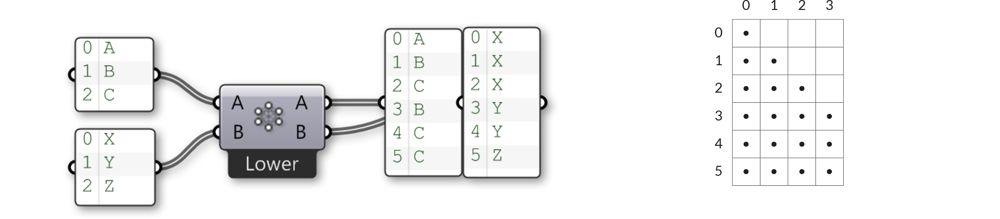

### 1.4.3. Соединение Потока Данных

>Файлы упражнения, которые сопровождают этот раздел: [http://grasshopperprimer.com/appendix/A-2/1_gh-files.html](http://grasshopperprimer.com/appendix/A-2/1_gh-files.html)

>Файлы упражнения, которые сопровождают этот раздел: [Download](../../appendix/A-2/gh-files/1.4.3_data matching.gh)


#####Соединение данных - это проблема, для которой нет одного решения. Это происходит, когда компонент имеет доступ к входам различного размера. Изменение алгоритма соединения данных может привести к значительно отличающимся результатам.

Представьте компонент, который создает сегменты линии между точками. Он будет иметь два параметра ввода, которые оба будут предоставлять координаты точек (Список А и Список Б):

Как вы можете видеть, существуют разные способы рисования линий между этими наборами точек. В Grasshopper 0.9 есть три новых компонента для соединения данных, они находятся в разделе Sets/List panel: Shortest List (самый короткий список), Longest List (самый длинный список) и Cross Reference (перекрестные ссылки). Эти новые компоненты позволяют добиться большей гибкости внутри трех базовых алгоритмов соединения данных. Кликните правой клавишей мыши по каждому компоненту и вы сможете выбрать опцию соединения данных из меню.

Самый простой способ - соединить входы один к одному пока один из потоков не исчерпает себя. Этот алгоритм называется  **“Shortest List” ** (самый короткий список):

>Выберите опцию алгоритма соединения из меню компонента правым кликом мыши по компоненту.

Алгоритм **“Longest List”** соединяет входы пока все потоки не иссякнут. Это поведение включено по умолчанию у всех компонентов:

И последнее, метод **“Cross Reference”** создает все возможные соединения:

Это может быть потенциально опасно, так как создается невероятно огромное количество выходов. Проблема усложняется еще тем, что вовлекается больше параметров ввода и наследование изменяемых данных начинает увеличивать данные, при этом  логика остается той же.

Давайте более подробно разберем компонент Shortest List:

Тут у нас имеются два входных списка {A,B,C,D,E} и {X,Y,Z}. Используя опцию Trim End, два последних элемента в первом списке не учитываются, поэтому списки становятся одинаковой длины.

Используя опцию Trim Start, два первых элемента в первом списке не учитываются, поэтому списки становятся одинаковой длины.

Опция Interpolate пропускает второй и четвертый элементы в первом списке. Теперь давайте посмотрим на компонент Cross Reference:

Тут у нас имеются два входных списка {A,B,C} и {X,Y,Z}. Обычно Grasshopper провел бы итерацию этих списков и рассмотрел бы только комбинации {A,X}, {B,Y} и {C,Z}. Тем не менее, тут имеются еще шесть комбинаций, которые обычно не рассматриваются, а именно: {A,Y}, {A,Z}, {B,X}, {B,Z}, {C,X} и {C,Y}. Как вы можете видеть, выход компонента Cross Reference таков, что присутствуют все девять сочетаний.

Мы можем отметить поведение данных перекрестных ссылок используя таблицу. Ряды представляют первый список элементов, колонки второй. Если мы создадим все возможные сочетания, таблица будет иметь точку в каждой отдельной ячейке, так как каждая ячейка представляет собой уникальную комбинацию двух индексов исходных списков.

Иногда, тем не менее, вы не хотите, чтобы происходили все возможные сочетания. Иногда вы хотите исключить некоторые области потому, что они приведут к бессмысленным или неправильным вычислениям. Общий принцип исключения - это игнорировать все ячейки, располагающиеся по диагонали таблицы. Изображение выше представляет "холистическое" соединение, где "диагональная" опция (доступна из меню компонента Cross Reference) имеет пропуски в {0,0}, {1,1}, {2,2} и {3,3}. Если мы применим это к нашим примерам {A,B,C}, {X,Y,Z}, нам следует ожидать, что мы не увидим комбинации для {A,X}, {B,Y} и {C,Z}:

Правило, которое применяется к "диагональному" соединению, следующее: "Пропустить все подстановки, где все элементы имеют такой же индекс списка". "Случайное" соединение - это то же самое, что "диагональное" соединение в случае двух вводных списков, но правило несколько отличается: "Пропустить все подстановки, где любые два элемента имеют такой же индекс списка".

Четыре оставшихся алгоритма соединения - это все вариации на ту же тему. Соединение "нижний треугольник" применяет правило: "Пропускать все подстановки, где индекс элемента меньше, чем индекс элемента в следующем списке", приводя в пустому треугольнику, но с элементами по диагонали.

Соединение "нижний треугольник" (строгий) идет на один шаг вперед и также устраняет элементы по диагонали:

"Верхний Треугольник" и "Верхний Треугольник (строгий)" - это зеркальное изображение двух предыдущих алгоритмов, результат которых пустой треугольник на другой стороне диагональной линии.
