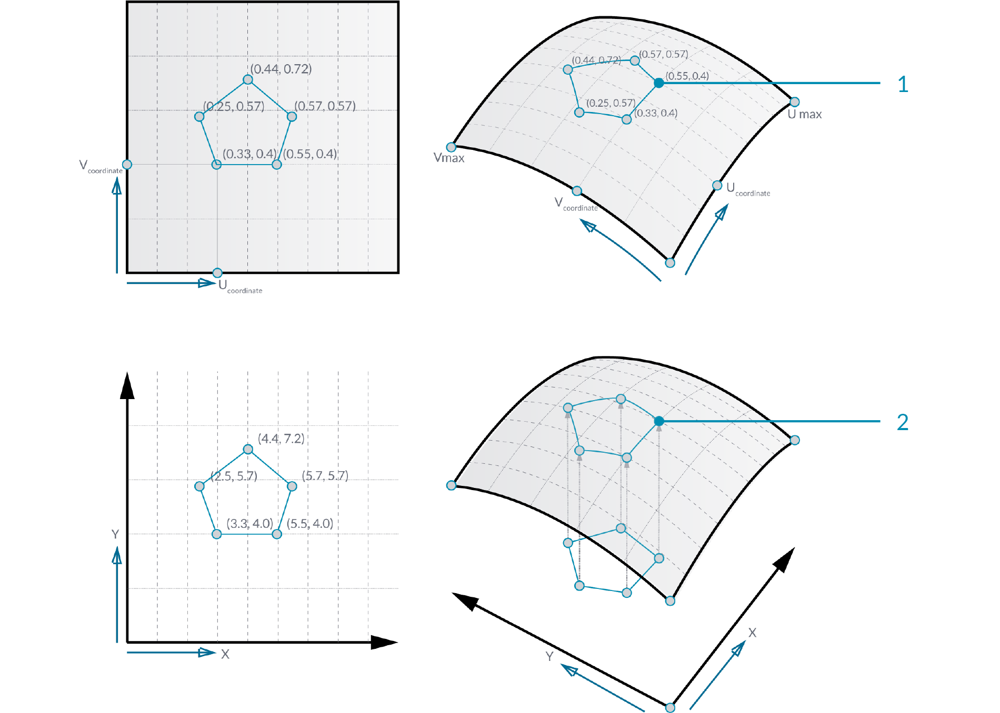

###1.5.1. Геометрия Поверхности

#####NURBS (неоднородные рациональные Б-сплайны) - математическое представление, которое может точно смоделировать любую форму из простой 2D линии, круга, арки или коробки в самую сложную 3D произвольной формы органическую поверхность или тело. Благодаря своей гибкости и точности, NURBS модели могут использоваться в любом процессе от иллюстрации и анимации до производства.

В отличие от нескольких примитивных типов поверхности, таких как сфера, конусы, плоскости и цилиндры, Rhino поддерживает три типа поверхностей свободных форм, самая полезная из которых NURBS поверхность. Как и кривые, все возможные формы поверхности могут быть представлены NURBS поверхностью, которая является запасной по умолчанию в Rhino. Она также, на данный момент, является самой полезной поверхностью определения и именно на ней мы и сосредоточимся.

>1. Сфера примитив [плоскость, радиус]
2. Цилиндр примитив [плоскость, радиус, высота]
3. Плоскость примитив [плоскость, ширина, высота]
4. Конус примитив [плоскость, радиус, высота]

####1.5.1.1. NURBS ПОВЕРХНОСТИ
NURBS поверхности очень похожи на NURBS кривые. Такие же алгоритмы используются для вычисления формы, нормалей, тангенсов, кривизны и других характеристик, но существуют и явные отличия. Например, кривые имеют тангенс векторы и нормальные плоскости, в то время как поверхности имеют нормальные векторы и тангенс плоскости. Это означает, что у кривых отсутствует ориентация, в то время как у поверхности отсутствует направление. В случае NURBS поверхностей, фактически два направления заложены в геометрию, потому что NURBS поверхности - это прямоугольные сетки кривых {u} и {v}. И даже хотя эти направления часто произвольны, мы все-равно их используем, потому что они облегчают нам жизнь.

>Вы можете рассматривать NURBS поверхности как сетку NURBS кривых, которые идут в двух направлениях. Форма NURBS поверхности определяется числом контрольных точек и порядком этой поверхности в направлениях "u" и "v". NURBS поверхности достаточны для хранения и представления поверхностей свободной формы с высокой степенью точности.

**Surface Domain**
Поверхность диапазона определяется порядком параметров (u,v), которые определяют в 3-D точке на этой поверхности. Диапазон в каждом пространстве (u или v) обычно описывается как два действительных числа (u_min к u_max) и (v_min к v_max). Изменение диапазона поверхности считается репараметризацией поверхности.

В Grasshopper часто бывает полезно репараметризировать NURBS поверхности так, чтобы диапазоны u и v были оба от 0 до 1. Это позволяет нам легко определить и производить операции на поверхности.

>Определение параметров на равных интервалах в 2-D параметрическом прямоугольнике не всегда переносится на равные интервалы в 3-D пространстве.

**Surface evaluation**
Определение поверхности по параметру, который является частью диапазона поверхности, приводит к точке на поверхности. Имейте ввиду, что середина диапазона (mid-u, mid-v) не обязательно может определять среднюю точку 3D поверхности. Также, при определении u и v значений, которые не входят диапазон поверхности, мы не получим какого-либо полезного результата.

**Normal Vectors and Tangent Planes**
Тангенс плоскость к поверхности в указанной точке - это плоскость, которая касается поверхности в этой точке. Z направление тангенс плоскости представляет нормальное направление поверхности в этой точке.

Grasshopper занимается NURBS поверхностями схожим образом как Rhino, потому что он построен на том же самом ядре операций, которые необходимы для генерации поверхности. Тем не менее, из-за того, что Grasshopper отображает поверхность поверх видового окна Rhino (именно поэтому, вы не можете выбрать геометрию, созданную через Grasshopper, в видовом окне, до тех пор, пока вы не запечете результаты в этой сцене) некоторые из настроек mesh слегка ниже, чтобы держать скорость вычислений Grasshopper достаточно высоко. Вы могли заметить некоторую граненность поверхности mesh, но это ожидаемо и является результатом настроек прорисовки Grasshopper. Любая запеченная геометрия будет все равно использовать самые высокие настройки mesh.

####1.5.1.2. ПРОЕЦИРОВАНИЕ ПОВЕРХНОСТЕЙ
В предыдущем разделе мы объяснили, что NURBS поверхности содержат их собственные координаты пространства, установленные диапазонами u и v. Это означает, что двух-пространственная геометрия, которая определяется координатами x и y, может быть перенесена на пространство uv. Геометрия будет растягиваться и изменяться в ответ на кривизну поверхности. В этом отличие от простого проецирования 2d геометрии на поверхность, где векторы прорисовываются из 2d геометрии в указанном направлении пока они не пересекутся с поверхностью.

>Вы можете думать о проецировании как о геометрии, накладывающей тень на поверхность, и о переносе как о геометрии, которую растянули по поверхности.
1. Перенесенная геометрия, определяемая координатами uv
2. Проецируемая геометрия на поверхность

Как 2d геометрия может быть спроецирована на пространство uv поверхности, так и 3d геометрия, находящаяся в коробке, может быть перенесена на соответствующую скрученную коробку на участке поверхности. Эта операция называется box morphing и используется для заполнения кривых поверхностей трех-пространственными геометрическими компонентами.

Чтобы разместить скрученную коробку на поверхности, диапазон поверхности должен быть разделен, чтобы создать сетку на участке поверхности. Скрученная коробка создается прорисовкой векторов нормали в углах каждого участка до желаемой высоты и созданием коробки, определяемой конечными точками тех векторов и угловых точек участка.

####1.5.1.3. ОПРЕДЕЛЕНИЕ ПРЕОБРАЗОВАНИЯ

>Файлы упражнения, которые сопровождают этот раздел: [http://grasshopperprimer.com/appendix/A-2/1_gh-files.html](http://grasshopperprimer.com/appendix/A-2/1_gh-files.html)

>Файлы упражнения, которые сопровождают этот раздел: [Download](../../appendix/A-2/gh-files/1.5.1.3_morphing definition.gh)


В этом примере, мы будем использовать компонент box morph для заполнения NURBS поверхности геометрическими компонентами.

>1. NURBS поверхность, заполненная компонентом.
2. Исходный компонент в исходной коробке.
3. Поверхность, разделенная на участки.
4. Скрученные коробки, размещенные на поверхности.

||||
|--|--|--|
|01.|Запустите новое определение набрав Ctrl+N (в Grasshopper)||
|02.|Зайдите в **Params/Geometry/Surface** – перетащите параметр **Surface** на холст <blockquote>Это поверхность, которая будет заполнена геометрическими компонентами.</blockquote>||
|03.|Зайдите в **Params/Geometry/Geometry** – перетащите параметр **Geometry** на холст <blockquote>Этот компонент будет размещен поверх поверхности.</blockquote>||
|04.|Кликните правой клавишей мыши по параметру **Surface** и выберите “Set One Surface” – выберите поверхность для привязки в видовом окне Rhino||
|05.|Кликните правой клавишей мыши по параметру **Geometry** и выберите “Set One Geometry” – выберите вашу геометрию Rhino||
|06.|Зайдите в **Maths/Domain/Divide Domain2** – перетащите компонент **Divide Domain2** на холст||
|07.|Зайдите в **Params/Input/Number Slider** – перетащите три слайдера **Number Sliders** на холст||
|08.|Дважды кликните по первому **Number Slider** и установите следующее: <ul>Rounding: Integer Lower Limit: 0 Upper Limit: 10 Value: 5</ul>||
|09.|Установите такие же значения на втором и на третьем **Number Sliders**||
|10.|Соедините выход параметра **Surface** с входом Domain (I) компонента **Divide Domain2**||
|11.|Подключите первый **Number Slider** к входу U Count (U) в компоненте **Divide Domain2**||
|12.|Подключите второй **Number Slider** к входу V Count (V) в компоненте **Divide Domain2**||
|13.|Зайдите в **Transform/Morph/Surface Box** – вытащите компонент **Surface Box** на холст||
|14.|Соедините выход параметра **Surface** с входом Surface (S) компонента **Surface Box**||
|15.|Соедините выход Segements (S) компонента **Divide Domain2** к входу Domain (D) компонента **Surface Box**|||

>Вы должны увидеть сетку скрученных коробок, заполняющих вашу исходную поверхность. Поменяйте слайдеры U и V, чтобы изменить количество коробок и используйте слайдер высоты, чтобы настроить их высоту.

||||
|--|--|--|
|16.|Подключите третий **Number Slider** к входу Height (H) в компоненте **Surface Box**||
|17.|Зайдите в **Surface/Primitive/Bounding Box** – перетащите компонент **Bounding Box** на холст||
|18.|Зайдите в **Transform/Morph/Box Morph** – перетащите компонент **Box Morph** на холст||
|19.|Соедините выход параметра **Geometry** с входом Content (C) компонента **Bounding Box**||
|20.|Соедините выход параметра **Geometry** с входом Geometry (G) компонента**Box Morph**||
|21.|Соедините выход Box (B) компонента **Bounding Box** с входом Reference (R) компонента **Box Morph**||
|22.|Соедините выход Twisted Box (B) компонента **Surface Box** с входом Target (T) компонента **Box Morph**|||

>Вы должны увидеть теперь, как ваша геометрия наполняет вашу поверхность.

