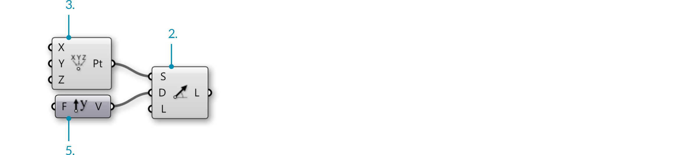
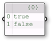

### 1.5.3. Создание Дерева Данных

>Файлы упражнения, которые сопровождают этот раздел: [http://grasshopperprimer.com/appendix/A-2/1_gh-files.html](http://grasshopperprimer.com/appendix/A-2/1_gh-files.html)

>Файлы упражнения, которые сопровождают этот раздел: [Download](../../appendix/A-2/gh-files/1.5.3_creating data trees.gh)


#####В Grasshopper есть инструменты для изменения структуры дерева данных. Эти инструменты могут помочь вам получить определенную информацию, касающуюся этого дерева, и изменить способ хранения, расположения и идентификации.

Давайте посмотрим на некоторые манипуляции с деревом данных и визуализируем то, как они влияют на дерево.

####1.5.3.1. FLATTEN
Flatten удаляет все уровни Дерева Данных и оставляет только один Список. Применяя компонент Flatten (Sets/Tree/Flatten) к выходу P компонента Divide Curve, мы можем использовать Param Viewer для визуализации новой структуры данных.

>В Param Viewer мы можем увидеть, что сейчас у нас только 1 ветка, содержащая список из 48 точек.

####1.5.3.2. GRAFT TREE
Grafting создает новую Ветку для каждого Элемента Данных. Если мы запустим данные через компонент Graft Tree (Sets/Tree/Graft Tree), каждая точка деления сейчас имеет свою отдельную ветку, а не делит ветку с другими точками делениями на той же самой кривой.

>В Param Viewer мы можем увидеть, какими были данные с 8 ветками из 6 элементов каждая и что сейчас мы имеем 8 веток с 6 под-ветками, содержащими по одному элементу каждая.

####1.5.3.3. SIMPLIFY TREE
Simplify удаляет накладывающиеся Ветки в Дереве данных. Если мы запустим данные через компонент Simplify Tree (Sets/Tree/Simplify Tree), то первая ветка, не содержащая данных, будет удалена.

>В Param Viewer у нас все равно имеется 8 веток из 6 элементов каждая, но первая ветка была удалена.

####1.5.3.4. FLIP MATRIX
Компонент Flip Matrix (Sets/Tree/Flip Matrix) меняет местами "Ряды" и "Колонки" Дерева Данных с двумя индекс путями.

>В Param Viewer мы можем увидеть, какими были данные с 8 ветками из 6 элементов каждая и что сейчас мы имеем 6 веток с 8 элементами каждая.

Действия Flatten, Graft и Simplify можно применить к входу или выходу компонента, вместо того, чтобы пропускать данные через отдельный компонент. Просто кликните правой клавишей по нужному входу или выходу и выберите Flatten, Graft или Simplify из меню. Компонент отобразит иконку, говорящую о том, что дерево было изменено. Помните о процессе работы Grasshopper. Если вы подключите Flatten к входу компонента, данные подвергнуться его воздействию до того, как действие компонента будет выполнено. Если вы подключите Flatten к выходу компонента, данные подвергнуться его воздействию после того, как компонент выполнит свое действие.

>1. Flattened выход P
2. Grafted выход P
3. Simplified выход P

####1.5.3.5. THE PATH MAPPER
Компонент Path Mapper (Sets/Tree/Path Mapper) позволяет вам выполнять лексические действия с деревьями данных. Лексические действия - это логические переносы между путями данных и индексы, которые определяются текстовыми (лексическими) масками и паттернами.

>1. Компонент Path Mapper
2. Кликните правой клавишей по компоненту Path Mapper и выбрать заранее заданную опцию переноса из меню или откройте Mapping редактор.
3. Mapping редактор
4. Вы можете изменить дерево данных путем еще одного переноса индекса пути и нужной ветки.

####1.5.3.6. WEAVING DEFINITION

>Файлы упражнения, которые сопровождают этот раздел: [http://grasshopperprimer.com/appendix/A-2/1_gh-files.html](http://grasshopperprimer.com/appendix/A-2/1_gh-files.html)

>Файлы упражнения, которые сопровождают этот раздел: [Download](../../appendix/A-2/gh-files/1.5.3.6_weaving definition.gh)


В этом примере мы будем работать со списками и деревьями данных, чтобы соединить списки точек, определить паттерг и создать поверхность геометрии.

>1. Вращающаяся NURBS поверхность
2. NURBS кривая
3. Массив кривой
4. Точки деления
5. Пути (индексы) точек

>1. Массив кривых
2. Разделение кривых на списки А и В, разделение кривых
3. Cull points, Weave и Revolve

||||
|--|--|--|
|01.| Запустите новое определение, набравCtrl+N (в Grasshopper)||
|02.| Зайдите в **Curve/Primitive/Line SDL** – перетащите компонент **Line SDL** на холст||
|03.| Зайдите в **Vector/Point/Construct Point** – перетащите компонент **Construct Point** на холст||
|04.| Соедините выход Point (Pt) компонента **Construct Point** с входом Start (S) компонента **Line SDL**||
|05.| Зайдите в **Vector/Vector/Unit Y** – перетащите компонент vector **Unit Y** на холст <blockquote>Коэффициент компонентов Unit Vector, по умолчанию, 1.0.</blockquote>||
|06.| Соедините компонент **Unit Y** с входом Direction (D) компонента **Line SDL**|||

||||
|--|--|--|
|07.| Зайдите в **Params/Input/Number Slider** – перетащите компонент **Number Slider** на холст||
|08.| Дважды кликните по **Number Slider** и установите следующее: <ul>Name: Length Rounding: Integer Lower Limit: 0 Upper Limit: 96 Value: 96</ul>||
|09.| Подключите **Number Slider** к входу Length (L) компонента **Line SDL**||
|10.| Зайдите в **Transform/Array/Linear Array** – перетащите компонент **Linear Array** на холст||
|11.|Соедините выход Line (L) компонента **Line SDL** с входом Geometry (G) компонента **Linear Array**||
|12.| Зайдите в **Vector/Vector/Unit X** – перетащите компонент vector **Unit X** на холст||
|13.| Зайдите в **Params/Input/Number Slider** – перетащите два компонента **Number Slider** на холст||
|14.| Дважды кликните по первому **Number Slider** установите следующее: <ul>Name: Offset Distance (Дистанция смещения) Rounding: Integer Lower Limit: 1 Upper Limit: 10 Value: 4</ul>||
|15.| Дважды кликните по второму **Number Slider** и установите следующее: <ul>Name: # of Offsets Rounding: Even Lower Limit: 2 Upper Limit: 20 Value: 20</ul>||
|16.| Подключите **Number Slider** (Offset Distance) к входу Factor (F) компонента **Unit X**||
|17.| Соедините выход Vector (V) компонента **Unit X** с входом Direction (D) компонента **Linear Array**||
|18.| Соедините выход **Number Slider** (# of Offsets)с входом Count (N) компонента **Linear Array**|||

>Сейчас вы должны увидеть массив линий в видовом окне Rhino. Три слайдера позволят вам изменить длину этих линий, их дистанцию друг от друга и число линий в массиве.

||||
|--|--|--|
|19.| Зайдите в **Sets/Lists/Dispatch** – перетащите компонент **Dispatch** component onto the canvasна холст||
|20.| Соедините выход Geometry (G) компонента **Linear Array** с входом List (L) компонента **Dispatch**||
|21.| Зайдите в **Params/Input/Panel** – перетащите компонент **Panel** на холст||
|22.| Дважды кликните по **Panel**, снимите выделение с Multiline Data, Wrap Items и Special Codes, и введите следующее: <ul>true false</ul>||
|23.| Соедините **Panel** с входом Pattern (P) компонента **Dispatch**||
|24.| Зайдите в **Curve/Division/Divide Curve** – перетащите два компонента **Divide Curve**на холст||
|25.| Соедините выход List A (A) компонента **Dispatch** с входом Curve (C) первого компонента **Divide Curve**||
|26.| Соедините выход List B (B) компонента **Dispatch** с входом Curve (C) второго компонента **Divide Curve**||
|27.| Зайдите в **Params/Input/Number Slider** – перетащите компонент **Number Slider** на холст||
|28.| Дважды кликните по **Number Slider** и установите следующее:<ul>Name: Divisions Rounding: Integer Lower Limit: 0 Upper Limit: 20 Value: 20</ul>||
|29.| Соедините **Number Slider** (Divisions) с входом Count (N) обоих компонентов **Divide Curve**.|||

>1. Компонент Dispatch отправляет каждую вторую кривую в массив на отдельный список.
2. Компонент Divide Curve разделяет кривые на число сегментов, определяемых слайдером. Настройте слайдер, чтобы менять количество точек.

||||
|--|--|--|
|30.| Зайдите в **Sets/Sequence/Cull Pattern** – перетащите два компонента **Cull Pattern** на холст||
|31.| Соедините выход Points (P) первого компонента **Divide Curve** с входом List (L) первого компонента **Cull Pattern**||
|32.| Соедините выход Points (P) второго компонента **Divide Curve** с входом List (L) второго компонента *Cull Pattern**||
|33.| Зайдите в **Params/Input/Panel** – перетащите второй компонент **Panel** на холст||
|34.| Дважды кликните на вторую **Panel** и снимите выделение с: Multiline Data, Wrap Items и Special Codes. Затем введите следующее:<ul>1 1 0 0</ul> <blockquote>Мы используем 1 и 0 вместо true и false. Grasshopper принимает два синтакса для булевых значений.</blockquote>||
|35.| Соедините вторую **Panel** с входом Pattern (P) первого компонента **Cull Pattern**||
|36.| Соедините вторую **Panel** с входом Pattern (P) второго компонента **Cull Pattern**||
|37.| Кликните правой клавишей мыши по входу Pattern (P) второго компонента **Cull Pattern** и выберите Invert  <blockquote>Это поможет инвертировать **Cull Pattern**, полезный трюк, чтобы ваше определение было компактным.</blockquote>||
|38.| Зайдите в **Sets/List/Weave** – перетащите компонент **Weave** на холст||
|39.| Соедините вторую **Panel** с входом Pattern (P) компонента **Weave**||
|40.| Кликните правой клавишей по входу Pattern (P) компонента **Weave** и выберите reverse||
|41.| Соедините выход List (L) первого компонента **Cull Pattern** с входом Stream 0 (0) компонента **Weave**||
|42.| Соедините выход List (L) второго компонента **Cull Pattern** с входом Stream 0 (0) компонента **Weave**||
|43.| Зайдите в **Curve/Spline/Nurbs Curve** – перетащите компонент **Nurbs Curve** на холст||
|44.| Соедините выход Weave (W) компонента **Weave** с входом Vertices (V) компонента **Nurbs Curve**.|||

>1. Cull patterns удаляет чередующиеся точки из каждого списка.
2. Компонент Weave собирает данные из списков точек в соответствии с настроенным паттерном. Эти данные передаются в компонент Interpolate для создания кривых.

||||
|--|--|--|
|45.| Зайдите в **Surface/Freeform/Revolution** – перетащите два компонента **Revolution** на холст||
|46.| Соедините выход Curve компонента **Nurbs Curve** с входом Profile Curve (P) обоих компонентов **Revolution**.||
|47.| Кликните правой клавишей мыши по входу Axis (A) обоих компонентов **Revolution** и выберите Graft.||
|48.| Соедините выход List A (A) компонента **Dispatch** с входом Axis (A) первого компонента **Revolution**||
|49.| Соедините выход List B (B) компонента **Dispatch** с входом Axis (A) второго компонента **Revolution**  <blockquote>Выберите все компоненты, за исключением двух компонентов Revolution, и отключите предпросмотр - это помогает при создании определения для того, чтобы сфокусироваться на самой новой геометрии</blockquote>|||

