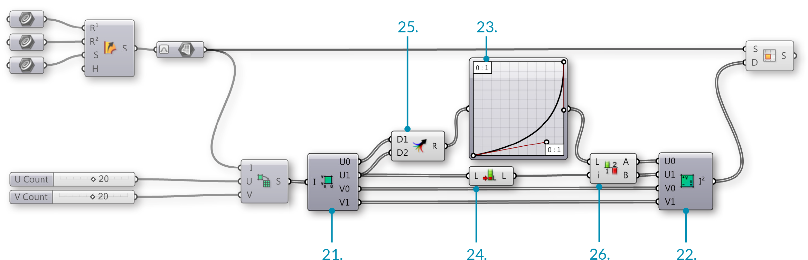

### 1.5.4. Работа с Деревьями Данных

>Файлы упражнения, которые сопровождают этот раздел: [http://grasshopperprimer.com/appendix/A-2/1_gh-files.html](http://grasshopperprimer.com/appendix/A-2/1_gh-files.html)

>Файлы упражнения, которые сопровождают этот раздел: [Download](../../appendix/A-2/gh-files/1.5.4_rail intersect definition.gh)


В этом примере, мы будем использовать некоторые инструменты Grasshopper для работы с деревьями данных для извлечения, реорганизации и интерполяции нужных точек, содержащихся в дереве данных и создания решетки пересекающихся ребер.

>1. Проведите две перекладины для создания NURBS поверхности.
2. Разделите поверхность на сегменты, переменного размера, исключите вершины. Данные, собранные в один список с четырьмя элементами для каждого сегмента.
3. Сделайте Flip матрицы, чтобы изменить структуру данных. Данные, собранные из четырех списков, каждый содержит одну угловую точку каждого сегмента.
4. Разбейте дерево, чтобы соединить угловые точки и прорисовать диагональные линий через каждый сегмент.
5. Сократите дерево до cull веток, содержащих неполные точки, чтобы создать NURBS кривую третьего порядка и интерполировать точки.
6. Вытянуть кривые, чтобы создать пересекающиеся окончания.

||||
|--|--|--|
|01.| Запустите новое определение, набрав Ctrl+N (в Grasshopper) ||
|02.| Зайдите в **Params/Geometry/Curve** – перетащите три параметра **curve** на холст ||
|03.| Зайдите в **Surface/Freeform/Sweep2** – перетащите компонент **Sweep2** на холст||
|04.| Кликните правой клавишей мыши по первому параметру **Curve** и выберите “Set one curve.” Выберите первую rail кривую в видовом окне Rhino||
|05.| Кликните правой клавишей мыши по второму параметру **Curve** и выберите “Set one curve.” Выберите вторую rail кривую в видовом окне Rhino||
|06.| Кликните правой клавишей мыши по третьему параметру **Curve** и выберите “Set one curve.” Выберите кривую в видовом окне Rhino||
|07.| Соедините выходы параметров **Curve** с входами Rail 1 (R1), Rail 2 (R2) и Sections (S) компонента **Sweep2** соответственно|||

>Мы только что создали NURBS поверхность

||||
|--|--|--|
|08.| Зайдите в **Params/Geometry/Surface** – вытащите параметр **Surface** на холст||
|09.| Соедините выход Brep (S) компонента **Sweep2** с входом параметра **Surface**||
|10.| Кликните правой клавишей мыши по параметру **Surface** и выберите “Reparameterize”.  <blockquote>На этом шаге мы заново перенесли диапазоны u и v поверхности между 0 и
1. Это позволит совершить дальнейшие операции.</blockquote>||
|11.| Зайдите в **Maths/Domain/Divide Domain2** – перетащите компонент **Divide Domain2** на холст||
|12.| Зайдите в **Params/Input/Number Slider** – вытащите два слайдера **Number Sliders**на холст||
|13.| Дважды кликните по первому **Number Sliders** и установите следующее:<ul>Rounding: Integer Lower Limit: 1 Upper Limit: 40 Value: 20</ul>||
|14.| Установите такие же значения на втором **Number Sliders**||
|15.| Соедините выход репараметризированого параметра **Surface** с входом Domain (I) компонента **Divide Domain2**||
|16.| Подключите первый **Number Sliders** к входу U Count (U) в компоненте **Divide Domain2**||
|17.| Подключите второй **Number Sliders** к входу V Count (V) в компоненте **Divide Domain2**||
|18.| Зайдите в **Surface/Util/Isotrim** – вытащите компонент **Isotrim** на холст||
|19.| Соедините выход Segments (S) компонента **Divide Domain2** с входом Domain (D) компонента **Isotrim**||
|20.| Соедините выход параметра **Surface** с входом Surface (S) компонента **Isotrim**|||

>Сейчас мы разделили поверхность на небольшие, легко измеримые, поверхности. Настройте слайдеры U и V Count для изменения числа подразделений. Давайте добавим Graph Mapper, чтобы размеры сегментов стали переменными.

||||
|--|--|--|
|21.| Зайдите **Maths/Domain/Deconstruct Domain2** – вытащите компонент **Deconstruct Domain2** на холст||
|22.| Зайдите **Maths/Domain/Construct Domain2** – вытащите компонент **Construct Domain2** на холст||
|23.| Зайдите в **Params/Input/Graph Mapper** – вытащите **Graph Mapper** на холст||
|24.| Зайдите в **Sets/List/List Length** – вытащите компонент **List Length** на холст||
|25.| Зайдите в **Sets/Tree/Merge** – вытащите компонент **Merge** на холст||
|26.| Зайдите в **Sets/List/Split List** – вытащите компонент **Split List** на холст  <blockquote>Компоненты Merge и Split используются, чтобы тот же самый Graph Mapper мог использоваться для обоих значений U min и U max.</blockquote>||
|27.| Соедините выходы U min (U0) и U max (U1) компонента **Deconstruct Domain2** с входами Data 1 (D1) и Data 2 (D2) компонента **Merge**||
|28.| Соедините выход Result (R) компонента **Merge** с входом **Graph Mapper**||
|29.| Кликните правой клавишей мыши по **Graph Mapper** и выберите “Bezier” в “Graph Types”||
|30.| Соедините второй связью из выхода U max (U1) компонента **Deconstruct Domain2** с входом List (L) компонента **List Length**||
|31.| Соедините выход **Graph Mapper** с входом List (L) компонента **Split List**||
|32.| Соедините выход Length (L) компонента **List Length** со входом Index (i) компонента **Split List**||
|33.| Connect the List A (A) output of the **Split List** component to the U min (U0) input of the **Construct Domain2** component||
|34.| Connect the List B (B) output of the **Split List** component to the U max (U1) input of the **Construct Domain2** component||
|35.| Connect the V min (V0) output of the **Deconstruct Domain2** component to the V min (V1) input of the **Construct Domain2** component||
|36.| Connect the V max (V1) output of the **Deconstruct Domain2** component to the V max (V1) input of the **Construct Domain2** component||
|37. |Connect the 2D Domain (I2) output of the **Construct Domain2** component to the Domain (D) input of the **Isotrim** component, replacing the existing connection|||

>We have just deconstructed the domains of each surface segment, remapped the U values using a Graph Mapper, and reconstructed the domains. Adjust the grips of the Graph Mapper to change the distribution of the surface segments. Let’s use Data Trees to manipulate the surface divisions.

||||
|--|--|--|
|38.| **Surface/Analysis/Deconstruct Brep** – Drag the **Deconstruct Brep** component onto the canvas||
|39.| **Sets/Tree/Flip Matrix** – Drag the **Flip Matrix** component to the canvas||
|40.| **Sets/Tree/Explode Tree** – Drag the **Explode Tree** component to the canvas||
|41.| Connect the Surface (S) output of the **Isotrim** component to the Brep (B) input of the **Deconstruct Brep** component  <blockquote>The Deconstruct Brep component deconstructs a Brep into Faces, Edges, and Vertices. This is helpful if you want to operate on a specific constituent of the surface.</blockquote>||
|42.| Connect the Vertices (V) output of the **Deconstruct Brep** component to the Data (D) input of the **Flip Matrix** component  <blockquote>We just changed the Data tree structure from one list of four vertices that define each surface, to four lists, each containing one vertex of each surface.</blockquote>||
|43.| Connect the Data (D) output of the **Flip Matrix** component to the Data (D) input of the **Explode Tree** component||
|44.| Right-click the **Explode Tree** component and select “Match Outputs”||
|45.| Right-click the Data (D) input of the **Explode Tree** component and select simplify|||

>Each output of the Explode Tree component contains a list of one vertex of each surface. In other words, one list with all the top right corners, one list with all the bottom right corners, one list of top left corners, and one list of bottom left corners.

||||
|--|--|--|
|46.| **Curve/Primitive/Line** – Drag and drop two **Line** components onto the canvas||
|47.| Connect the Branch 0 {0} output of the **Explode Tree** component to the Start Point (A) input of the first **Line** component||
|48.| Connect the Branch 1 {1} output of the **Explode Tree** component to the Start Point (A) input of the second **Line** component||
|49.| Connect the Branch 2 {2} output of the **Explode Tree** component to the End Point (B) input of the first **Line** component||
|50.| Connect the Branch 3 {3} output of the **Explode Tree** component to the End Point (B) input of the second **Line** component|||

>We have now connected the corner points of each surface diagonally with lines.

||||
|--|--|--|
|51.| **Curve/Util/Join Curves** – Drag and drop the **Join Curves** component to the canvas||
|52.| **Curve/Analysis/Control Points** – Drag a **Control Points** component onto the canvas||
|53.| **Curve/Spline/Interpolate** – Drag and drop the **Interpolate** component onto the canvas||
|54.| Connect the Line (L) outputs of each **Line** component to the Curves (C) input of the **Join Curve**s component   <blockquote>Hold down the Shift key to connect multiple wires to a single input<blockquote> ||
|55.| Connect the Curves (C) output of the **Join Curves** component to the Curve (C) input of the **Control Points** component||
|56.| Connect the Points (P) output of the **Control Points** component to the Vertices (V) input of the **Interpolate** component|||

>We have now joined our lines into polylines and reconstructed them as NURBS curves by interpolating their control points. In the Rhino viewport, you might notice that the shorter curves are still straight lines. This is because you cannot make a degree three NURBS curve with fewer than four control points. Let’s manipulate the data tree to eliminate lists of control points with less than four items.

||||
|--|--|--|
|57.| **Sets/Tree/Prune Tree** – Drag and drop the **Prune Tree** component onto the canvas||
|58.| **Params/Input/Panel** – Drag a Panel onto the canvas||
|59.| Connect the Points (P) output of the **Control Points** component to the Tree (T) input of the **Prune Tree** component  <blockquote>If you connect one Param Viewer to the Points (P) output of the Control Points component, and another to the Tree (T) output of the Prune Tree component, you can see that the number of branches has been reduced.</blockquote>||
|60.| Double click the **Panel** and enter 4.||
|61.| Connect the output of the **Panel** to the Minimum (N0) input of the **Prune Tree** component||
|62.| Connect the Tree (T) output of the **Prune Tree** component to the Vertices (V) input of the **Interpolate** component||
|63.| **Surface/Freeform/Extrude** – Drag and drop the **Extrude** component onto the canvas||
|64.| **Vector/Vector/Unit Y** – Drag a **Unit Y** component onto the canvas  *You may need to use a Unit X vector, depending on the orientation of your referenced geometry in Rhino*||
|65.| **Params/Input/Number Slider** – Drag a **Number Slider** onto the canvas||
|66.| Double click the **Number Slider** and set the following:<ul>Rounding: Integer Lower Limit: 1 Upper Limit: 5 Value: 3</ul>||
|67.| Connect the Curve (C) output of the **Interpolate** component to the Base (B) input of the **Extrude** component||
|68.| Connect the **Number Slider** output to the Factor (F) input of the **Unit Y** component||
|69.| Connect the Unit Vector (V) output of the **Unit Y** component to the Direction (D) input of the **Extrude** component|||

>You should now see a diagonal grid of strips or fins in the Rhino Viewport. Adjust the Factor slider to chnage the depth of the fins

