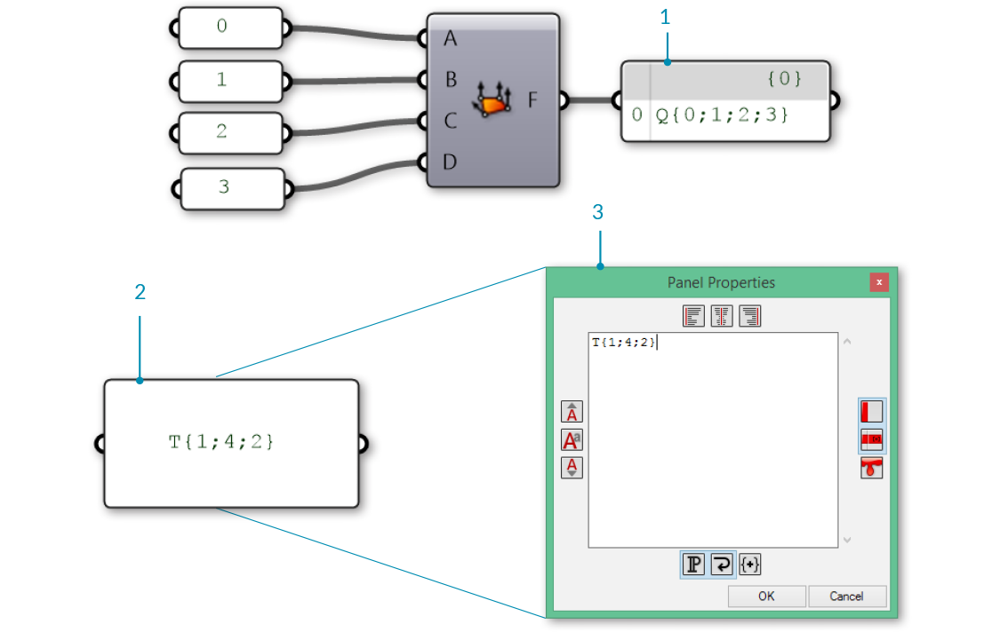
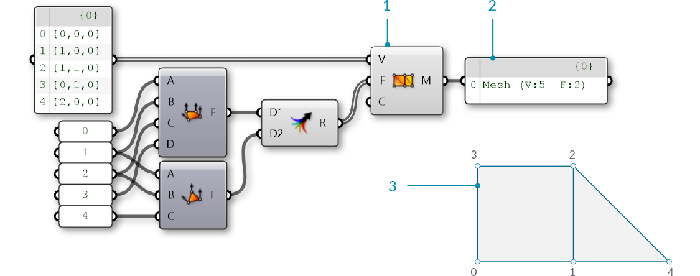

### 1.6.1 Что такое Mesh?

#####Mesh - это набор четырехугольников и треугольников, который образует поверхность или твердое тело. В этой секции обсуждается структура объекта Mesh, которая включает вершины, ребра и поверхности, а также дополнительные характеристики mesh, такие как цвет и нормали.

>1. Вершины Mesh
2. Ребра Mesh
3. Поверхности Mesh

####1.6.1.1 Основное строение Mesh

Grasshopper определяет mesh, используя структуру данных Face-Vertex. На самом примитивном уровне, это структура представляет собой набор точек, которые группируются в полигоны. Точки mesh называются vertices (вершины), а полигоны - faces. Чтобы создать mesh, нам требуется список вершин и система группирования этих вершин в полигоны.

>1. Список вершин.
2. Полигоны с группами вершин

**Вершины**

Вершины mesh - это просто список точек. Напомним, что список Grasshopper - это набор объектов. Каждый объект в списке, имеет индекс, который описывает положение объектов в списке. Индекс вершины имеет большую важность при создании mesh, при получении информации о структуре mesh.

>1. Список точек. Все списки в Grasshopper начинаются с индекса ноль
2. Набор точек со своими индексами

**Полигоны**

Face - это структурированный список из трех-четырех вершин. "Поверхностное" представление поверхности mesh означает в соответствии с положением вершины и ее индексом. У нас уже есть список вершин, которые составляют mesh, поэтому, вместо предоставления отдельных точек для определения face, мы просто используем индекс вершин. Это также позволяет нам использовать одну и ту же вершину в более чем одном полигоне.

>1. Четырехугольный полигон состоит из индексов 0, 1, 2 и 3
2. Треугольный полигон состоит из индексов 1, 4 и 2

В Grasshopper face могут создаваться компонентами **Mesh Triangle** и **Mesh Quad**Вводные параметры для этих компонентов - целые числа, которые соответствуют индексу вершин, которые мы хотим использовать для создания полигона. Соединяя **Panel** с выходом этих компонентов, мы можем увидеть, что треугольный полигон представлен как T{A;B;C} и четырехугольный полигон как Q{A;B;C;D}. Полигон с более чем 4 сторонами не допускаются. Чтобы создать 5-сторонний элемент mesh, mesh должна быть разбита на два или более полигона.

>1. Компонент **Mesh Quad** с индексами 0, 1, 2 и 3
2. Компонент **Mesh Triangle** с индексами 1, 4 и 2

Важно помнить, что эти компоненты не создают геометрию mesh, также как и выход - это список индексов, которые определяют, как mesh должна создаваться. Уделяя внимание формату этого списка, мы также можем создать полигон вручную путем редактирования компонента **Panel** вводя подходящий формат для треугольных либо четырехугольных полигонов.

>1. Полигон, созданный с использованием компонента **Mesh Quad**
2. Полигон, созданный с использованием **Panel**
3. Окно характеристик Panel автоматически открывается при двойном клике по панели при масштабировании или при правом клике по панели и выборе "Edit Notes..."

На данный момент у нас есть список вершин и набор файлов полигонов, но мы все еще не создали mesh. Чтобы создать mesh, нам нужно соединить полигон и вершины используя компонент **Construct Mesh** Мы подключаем наш список вершин к входу V и смешанный список полигонов к входу F. (У компонента также есть дополнительный вход для цвета, мы обсудим это позже.) Если мы подключим panel к выходу **Construct Mesh** мы сможем увидеть информацию о числе полигонов и числе индексов.

>1. Компонент **Construct Mesh** берет список вершин и список полигонов как вводные данные. Вход Color опциональный, оставляется пустым пока что
2. Panel показывает, что мы создали mesh с 5 вершинами и 2 полигонами
3. Итоговая mesh (вершины были пронумерованы по их индексам)

По умолчанию, Grasshopper не показывает ребра геометрии mesh. Чтобы предварительно посмотреть на ребра и на поверхности, вы можете включить предпросмотр ребер mesh, используя комбинацию Ctrl-M или пройдя в меню Display и выбрав "Preview Mesh Edges".

Очень важно обратить внимание на порядок индексов при создании полигона mesh. Полигон будет создаваться при соединении пронумерованных вершин по порядку, так что четырехугольные полигоны Q{0,1,2,3} и Q{1,0,2,3} очень отличаются, несмотря на то, что используют одни и те же четыре вершины. Неправильное упорядочивание вершин может вести к проблемам, таким как щели (отверстия), неоднородная геометрия mesh либо неориентируемая поверхность. Такая геометрия mesh обычно неправильно рендерится и ее невозможно отправить на 3D печать. Эти вопросы обсуждаются более подробно в разделе **Understanding Topology**.

>1. Четырехугольный полигон с индексами 0,1,2,3
2. Четырехугольный полигон с индексами 0,3,1,2

####1.6.1.2 Скрытые данные Mesh

В дополнение к полигонам и вершинам, есть и другая информация о mesh, которую мы хотим использовать. В mesh, основанной на Face-Vertex, такие данные как *edges* (ребра) и *normals* (нормали) рассчитываются непрямо, на основе данных полигона и вершин. Этот раздел описывает способы получение этой информации.

**Ребра**

*Ребра* это линии, соединяющие любые две последовательные вершины в полигоне. Заметьте, что некоторые ребра принадлежат к нескольким полигонам, в то время как другие ребра принадлежат только одному полигону. Число полигонов, к которым ребра принадлежат, называется *valence* (валентность) этого ребра.

Grasshopper groups edges into three categories based on the valence:

1. E1 - 'Naked Edges' have a valence of 1. They make up the external boundary of a mesh.
2. E2 - 'Interior Edges' have a valence of 2. 
3. E3 - 'Non-Manifold Edges' have a valence of 3 or greater. Meshes that contain such structure are called "Non-Manifold", and are discussed in the next section.

>1. Naked edge with valence of 1
2. Interior edge with valence of 2
3. Non-manifold edge with valence of 3

We can use the **Mesh Edges** component to get the edges of a mesh outputted according to valence. This allows us to locate edges along the boundary of a mesh, or to identify non-manifold edges. Sometimes, however, it is more useful to have the full boundary of each face. For this, we can use the **Face Boundaries** component. This will return a polyline for each face.

>1. The **Mesh Edges** component outputs three sets of edges. This mesh has 5 naked edges, 1 interior edge, and zero non-manifold edges
2. The E3 output is empty, because this mesh does not have any non-manifold edges, resulting in an orange wire.
3. The **Face Boundaries** component outputs one polyline for each face

**Face Normals**

A *normal vector* is a vector with a magnitude of one that is perpendicular to a surface. In the case of triangular faces, we know that any three points must be planar, so the normal will be perpendicular to that plane, but how do we know which direction ('up' or 'down') the normal will be pointing? Once again, the order of the indicies is crucial here. Mesh faces in Grasshopper are defined counter-clockwise, so a face with indices {0,1,2} will be 'flipped' as compared to the indicies {1,0,2}. Another way to visualize this is to use the *Right-Hand-Rule*. 

>1. The **Face Normals** component will return a list of center points and normal vectors for each face
2. Face normals according to vertex sequence
3. "Right-Hand-Rule" for determining normal direction

Grasshopper also allows quad faces, in which case the 4 points will not always be planar. For these faces, the center point will be simply the average of the coordinates of the 4 vertices (in the case of a non-planar quad, note that this point is not necessarily on the mesh). To calculate the normal of a quad face, we need to first trianglulate the quad by splitting it into two planar triangles. The normal of the overall face is then the average of the two normals, weighted according to the area of the two triangles.

**Vertex Normals**

In addition to the face normals, it is also possible to calculate normals for each vertex of a mesh. For a vertex that is only used in a single face, the normal at the vertex will point in the same direction as the face normal. If a vertex has multiple adjacent faces, the vertex normal is calculated by taking the average of the faces. 

While less intuitive than face normals, vertex normals are important for smooth visualization of meshes. You might notice that even when mesh is composed of planar faces, such a mesh can still appear smooth and rounded when shaded in Rhino. Using the vertex normals allows this smooth visualization.

>1. Normals set according to the face normal results in discrete polygonal shading
2. Adjancent face normals are averaged together to create vertex normals, resulting in smooth shading across faces

####1.6.1.3 Mesh Attributes

Meshes can also be assigned additional attributes to either vertices or faces. The simplest of these is vertex color, which is described below, but other attributes exist such as texture UV coordinates. (Some programs even allow vertex normals to be assigned as attributes instead of being derived from the faces and vertices, which can provide even more flexibility in rendered surface appearance.)

**Color**

When using a **Construct Mesh** component, there is an option input for vertex color. Colors can also be assigned to an existing mesh using the **Mesh Color** component. By using a single color for a mesh, we can color the entire mesh.

>Trianglular mesh objects colored with red, green, or blue

While the above examples colored the entire mesh, color data are actually assigned for each vertex. By using a list of three colors, we can color each vertex in the triangle separately. These colors are used for visualitizations, with each face rendered as an interpolation of the vertex colors. For example, the image below shows a triangular face with vertex colors of Red, Green, and Blue.

>1. Red, green, and blue are assigned to the three vertices of a mesh
2. The resulting mesh interpolates the colors of the vertices

####1.6.1.4 Exercise

>Example files that accompany this section: [http://grasshopperprimer.com/appendix/A-2/1_gh-files.html](http://grasshopperprimer.com/appendix/A-2/1_gh-files.html)

>Example files that accompany this section: [Download](../../appendix/A-2/gh-files/1.6.1_what is a mesh.gh)


||||
|--|--|--|
|01.| Start a new definition, type Ctrl-N (in Grasshopper)||
|02.| **Mesh/Primitive/Mesh Quad** - Drag and drop a **Mesh Quad** component onto the canvas||
|03.| **Mesh/Primitive/Construct Mesh** - Drag and drop a **Construct Mesh** component onto the canvas|
|04.| Connect the Face (F) output of the **Mesh Quad** component to the Faces (F) input of the **Construct Mesh** component|||

> **Mesh Quad** and **Construct Mesh** have default values which create a single mesh face. Next, we will replace the default values with our own vertices and faces.

||||
|--|--|--|
|05.| **Params/Input/Panel** - Drag and drop a **Panel** component onto the canvas||
|06.| Double-click the **Panel** component and set the value to '0'||
|07.| **Params/Input/Panel** - Drag and drop four more **Panel** components onto the canvas and set their values to 1,2,3, and 4   <blockquote>You can also copy the original **Panel** by clicking and dragging, then tapping the Alt key before releasing the click</blockquote>||
|08.| Connect the **Panels** to the inputs of the **Mesh Quad** in the following order:<ul>0 - A 1 - B 2 - C 3 - D</ul>||
|09.| **Mesh/Primitive/Mesh Triangle** - Drag and drop a **Mesh Triangle** component onto the canvas||
|10.| Connect the **Panels** to the inputs of the **Mesh Triangle** component in the following order: <ul>1 - A 2 - B 4 - C</ul>||
|11.| **Sets/Tree/Merge** - Drag and drop a **Merge** component onto the canvas||
|12.| Connect the Face (F) output of the **Mesh Quad** component to the Data1 (D1) input of the **Merge** component, and the Face (F) output of the **Mesh Triangle** component to the Data2 (D2) input of the **Merge** component||
|13.| Connect the Result (R) output of the **Merge** component to the Faces (F) input of the **Construct Mesh** component|||

>The default Vertices (V) list of **Construct Mesh** only has 4 points, but our **Mesh Triangle** component uses an index of 4, which would correspond to the fifth point in a list. Since there are not enough vertices, the **Construct Mesh** component gives an error. To fix it, we will provide our own list of points.

||||
|--|--|--|
|14.| **Params/Input/Panel** - Drag and drop a **Panel** component onto the canvas||
|15.| Right-click the **Panel** component and de-select the 'Multiline Data' option  <blockquote>By default, a panel has 'Multiline Data' enabled. By disabling it, each line in the panel will be read as a separate item within a list.</blockquote>||
|16.| Double-click the **Panel** component to edit it, and enter the following points: <ul>{0,0,0} {1,0,0} {1,1,0} {0,1,0} {2,0,0}</ul><blockquote>Make sure you use the correct notation. To define a point in a **Panel**, you have to use curly brackets: '{' and '}' with commas between the x, y, and z values</blockquote>||
|17.| Connect the **Panel** component to the Vertices (V) input of the **Construct Mesh** component|||

>We now have a mesh with two faces and 5 vertices.  

Optionally, we can replace the **Mesh Quad** and **Mesh Triangle** components with a panel specifying the indices of the faces.

||||
|--|--|--|
|18.|**Params/Input/Panel** - Drag and drop a **Panel** component onto the canvas||
|19.|Right-click the **Panel** component and deselect 'Multiline Data'   <blockquote>Alternatively, copy the existing **Panel** that we used for the points, which already has 'Multiline Data' disabled</blockquote>||
|20.|Double-click the **Panel** component to edit it, and enter the following: <ul>Q{0,1,2,3} T{1,2,4}</ul>||
|21.|Connect the **Panel** to the Faces (F) input of the **Construct Mesh** component|||

||||
|--|--|--|
|22.| **Params/Input/Colour Swatch** - Drag and drop a **Colour Swatch** component onto the canvas||
|23.| Click the colored section of the component (the default is White) to open the color selection panel||
|24.| Use the sliders to set the G and B values to zero. The swatch should now be Red||
|25.| **Params/Input/Colour Swatch** - Drag and drop two more **Colour Swatch** components onto the canvas and set their colors to Blue and Green||
|26.| **Sets/Tree/Merge** - Drag and drop a **Merge** component onto the canvas||
|27.| Connect the three **Color Swatch** components into the D1, D2, and D3 inputs of the **Merge** component.||
|28.| Connect the Result (R) output of the **Merge** component to the Colours (C) input of the **Construct Mesh** component|||

>We have 5 vertices, but only 3 colors. Grasshopper will assign the colors in a repeating pattern, so in this cases vertices 0 and 3 will be Red, vertices 1 and 4 will be Green, and the final vertex 2 will be Blue.

