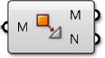

### 1.6.4 Mesh Operations

#####In the last section, we looked at the basic structure of a mesh. In this section, we will look at ways to manipulate mesh geometry.

####1.6.4.1 Smooth

Smoother meshes can sometimes be achieved by simply increasing the number of faces in a process called *subdivision*. This can often lead to extremely large datasets which take a long time to calculate, and requires additional add-ons to Grasshopper that are not built-in. In these situations, the **Smooth** component can be used as an alternative to make meshes less jagged or faceted, without increasing vertex and face count or changing the topology.  The *strength*, *number of iterations*, and displacement *limit* can all be used to adjust how much smoothing occurs.

Attaching a boolean value to the input N provides option to skip naked vertices. A vertex is naked if it is connected to a naked edge, meaning the vertex is on the boundary of an open mesh. By toggling this option, you maintain the exterior boundary of a mesh while smoothing the interior edges.

>1. Initial box mesh with 3 faces removed
2. Smoothing after 2 iterations
3. 6 iterations
4. 25 iterations
5. 50 iterations

####1.6.4.2 Blur

The **Blur** component acts in a similar way as smooth, except it only affect the vertex colors. It can also be used to reduce the jagged appearance of colored meshes, although to a lesser extent since it does not change any geometry.

>1. Initial mesh
2. Blur after 1 iterations
3. 6 iterations
4. 12 iterations
5. 20 iterations

####1.6.4.3 Triangulate

In order to ensure each face is planar, or to export a mesh to a different software that might not allow quad faces, it is sometimes necessary to triangulate a mesh. Using the **Triangulate** component, each quad face is replaced with two triangle faces. Grasshopper always uses the shortest diagonal of the face to create a new edge.

>1. Original quad mesh
2. Added edges according to shortest distance across quads
3. Triangulated resultant mesh

####1.6.4.4 Weld

In the last section, we noticed that a single vertex can be shared by adjacent faces and the normal for that vertex is calculated as the average of the adjacent faces, allowing a smoother visualization. However, it is sometimes desireable to have a sharp crease or seam where one face does not smoothly transition to the next by way of the vertex normals. For this situation it is necessary for each face to have its own vertex with its own normal. The list of vertices would contain at least two points that have the same coordinates, but different indices.

>1. Welded Faces - Both faces share vertices 1 and 2. The vertex normals at these vertices are the average of the face vertices.
2. Unwelded Faces - Duplicate vertices are added to the list. The faces do not share any vertex indices. Vertices 1 and 6, and vertices 2 and 5 have identical coordinates, but are separate vertices. They each have their own vertex normal

The process of taking two vertices that are in the same position and combining them into a single vertex is called *welding*, while *unwelding* takes a single vertex and splits it into multiple vertices.

The **Weld** component uses a threshold angle as input. Any two adjacent faces with an angle less than the threshold angle will be welded together, resulting in common vertices with a normal that is the average of the adjacent faces. **Unweld** works in the opposite manner, where adjancent faces with an angle greater than the given threshold will be unwelded, and their shared vertices will be duplicated.

>1. The default Box Mesh has 726 vertices. The mesh is creased at the corners of the box, where vertices are doubled up.
2. If the mesh is welded with an angle greater than 90 degrees, the resulting mesh faces are welded together, and the number of vertices has decreased to 602 while the number of faces has remained the same.
3. Looking at the previewed geometry, you can also notice that the rendered welded mesh has smoothed corners. 
4. Unlike the Smooth component which changes the mesh geometry, this mesh only appears smoother due to the vertex normal's role in rendering and shading. The actual positions of the vertices remain unchanged.

In the above image, we used the angle 91 degrees because we know that the sides of a square will be at 90 degree angles. To completely weld an entire mesh you should use an angle of 180 degrees.
