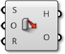

### 1.6.5 Взаимодействие Mesh

##### Этот раздел рассматривает способы взаимодействия Объектов Mesh с другими объектами, такими как определение ближайших точек или объединение множества mesh вместе.

#### 1.6.5.1 Геометрия Mesh и Точки

**Inclusion**

Этот компонент проверяет и определяет, находится ли данная точка внутри твердого тела mesh или нет. Это работает только с закрытыми mesh.

**Mesh Closest Point**

Этот компонент рассчитает положение на mesh, ближайшее к данной точке. Этот компонент выдает три части данные: координаты рассчитанной точки на mesh, индекс полигона, которые содержит эту точку и параметр mesh. Этот параметр невероятно полезен в связке с компонентом **Mesh Eval**, который обсуждается ниже.

>1. Данная точка в пространстве, Мы хотим найти ближайшую ближайшую точку на mesh
2. Полигон, который содержит ближайшую точку, определен
3. Рассчитаны параметры ближайшей точки на полигоне

Для тех пользователей, которые заинтересованны в больших подробностях о том, как параметризуется mesh, мы можем рассмотреть подробнее, как структурированы параметры mesh. Вы можете увидеть эту структуру путем прикрепления panel к выходу параметра компонента **Mesh Closest Point**. Параметр mesh имеет форму: N[A,B,C,D]. Первое число, N, - это индекс полигона, который содержит расчетную точку. 

Следующие четыре числа определяют *барицентрические* координаты точки внутри этого полигона. Координаты исходной точки можно найти путем умножения каждой вершины полигона на эти числа по порядку и затем складывания результатов вместе. (Конечно, это уже сделано за нас и дается в выходе Point). Также заметьте, что барицентрические координаты уникальны только для треугольных полигонов, что означает, что на четырехугольном полигоне та же самая точка может иметь множество различных определений значений параметров. Grasshopper избегает этой проблемы путем внутренней триангуляции четырехугольного полигона при расчете параметра, результат которого и есть одно из тех четырех чисел в параметре mesh, по меньшей мере, одно из них всегда будет ноль.

>Барицентрические координаты

**Mesh Eval**

Компонент **Mesh Eval** использует параметр mesh как вход и выдает исходную точку, а также нормаль и цвет в этой точке. Цвет и нормаль рассчитываются как интерполяции цветов вершин и нормалей вершин, используя те же самые барицентрические координаты как параметр mesh.

#### 1.6.5.2 Объединение Геометрии Mesh 

**Mesh Join**

В отличие от объединения кривых или NURBS поверхностей, которые требуют смежности, любые mesh могут быть объединены в одну mesh - даже mesh, которые не соприкасаются. Вспомните, что mesh - это просто список вершин или список полигонов. Нет требования о том, что те полигоны должны быть соединены (Хотя в большинстве приложений, такая mesh будет не желательной!!).

Этот компонент не спаивает вершины mesh вместе, поэтому часто полезно использовать его в комбинации с компонентом **Weld**.

**Mesh Boolean**

Mesh в Grasshopper имеет набор булевых операций похожих на булевые операции для твердных тел NURBS.   Булевые операции зависят от порядка, это означает, что переключение порядка входа mesh A и B приведет к разным выходам.

>1. Различие Mesh
2. Пересечение Mesh
3. Разделение Mesh
4. Объединение Mesh

#### 1.6.5.3 Intersections (Пересечения) и Occlusions (Преграды)

**Intersect**

Пересечения могут быть рассчитаны между mesh и другими объектами: лучи, плоскости, кривые и другие mesh.

>1. Mesh | Луч
2. Mesh | Плоскость
3. Mesh | Кривая
4. Mesh | Mesh

**Occlusion**

Как мы уже обсуждали, одно из (множества) использований mesh геометрии - для визуализации и создания теневых рендеров на основе нормалей полигона. При рендера, также необходимо знать, когда объект в тени находится позади другого объекта. Компонент **Occlusion** в Grasshopper позволяет нам вводить точки выборки, совместно с преграждающей mesh геометрией, которая будет "отбрасывать тень", и *вид Ray*, или, вектор, чтобы отобразить направление исходящего "света".

Такой процесс может быть использован для создания теней в рендере или для того, чтобы определить спрятан ли объект от определенного вида видеокамеры.

>1. Вид Ray для проверки преграждения
2. Преграждающая геометрия mesh
3. 'Hit' точки выборки
4. 'Преграждающие' точки выборки
