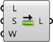

### 1.6.6 Работа с геометрией Mesh

##### В этом разделе мы будем работать над производством твердого тела mesh. К концу этого упражнения у нас будет динамическое определение для производства индивидуальных ваз, которые можно напечатать на 3D принтере.


>Файлы упражнения, которые сопровождают этот раздел: [http://grasshopperprimer.com/appendix/A-2/1_gh-files.html](http://grasshopperprimer.com/appendix/A-2/1_gh-files.html)

>Файлы упражнения, которые сопровождают этот раздел: [Download](../../appendix/A-2/gh-files/1.6.6_working with meshes.gh)


Так как это определение несколько больше, чем предыдущие упражнения в этом пособии, мы сначала разберем базовые этапы, через которые мы пройдем:

>1. Создадим последовательность кругов в качестве базового цилиндра
2. Используем компонент Graph Mapper, чтобы определить контур нашей вазы
3. Создадим топологию полигонов mesh, чтобы  произвести единую поверхность mesh
4. Закроем низ mesh
5. Введем закручивание по вертикали для создания более динамической формы
6. Добавим складчатые ребра для текстуры
7. Сместим поверхность mesh, чтобы придать вазе толщину
8. Закроем верхний зазор между двумя поверхностями, чтобы создать закрытое твердое тело

||||
|--|--|--|
|01.| Запустите новое определение, набрав Ctrl+N (в Grasshopper)||
|02.| Зайдите в **Params/Geometry/Point** - вытащите контейнер **Point** на холст||
|03.| Кликните правой клавишей мыши в Rhino по компоненту **Point** и выберите Set one Point, чтобы привязать точку. Она будет служить исходной точкой нашей вазы.   <blockquote>Вы можете создать точку вручную в Grasshopper, дважды кликнув по холсту, чтобы вызвать окно поиска, затем ввести координаты точки, разделенные запятыми, вот так: '0,0,0' (без кавычек) </blockquote>||
|04.| Зайдите в **Params/Input/Number Slider** - вытащите компонент **Number Slider** на холст и установите следующие значения: <ul>Name: Length Lower Limit: 1 Upper Limit: 10</ul>||
|05.| Зайдите в **Curve/Primitive/Line SDL** - вытащите компонент **Line SDL** на холст||
|06.| Соедините компонент **Point** с входом Start (S) компонента **Line SDL** и соедините слайдер **Number Slider** с входом Length (L).   <blockquote>Значение Direction (D) компонента **Line SDL**, по умолчанию, Unit Z вектор, который мы будем использовать в этом упражнении.</blockquote>||
|07.| Зайдите в **Params/Input/Number Slider** - вытащите компонент **Number Slider** на холст и установите следующие значения: <ul>Name: V Count Rounding: Integer Lower Limit: 1 Upper Limit: 100</ul>||
|08.| Зайдите в **Curve/Division/Divide Curve** - вытащите компонент **Divide Curve** на холст||
|09.| Соедините выход Line (L) компонента **Line SDL** с входом Curve (C) компонента **Divide Curve**||
|10.| Подключите слайдер **V Count** к входу Count (N) компонента **Divide Curve**||
|11.| Зайдите в **Curve/Primitive/Circle CNR** - вытащите компонент **Circle CNR** на холст||
|12.| Соедините выход Points (P) компонента **Divide Curve** с входом Center (C) компонента **Circle CNR**|||

>Теперь у нас есть последовательность вертикально расположенных кругов. Мы будем далее использовать их для создания контура нашей вазы.

Далее, мы будем использовать Graph Mapper, чтобы контролировать радиус кругов.

||||
|--|--|--|
|13.| Зайдите в **Sets/Sequence/Range** - вытащите компонент **Range** на холст||
|14.| Подключите слайдер **V Count** к входу Steps (N) компонента **Range**||
|15.| Зайдите в **Params/Input/Graph Mapper** - вытащите компонент **Graph Mapper** на холст||
|16.| Кликните правой клавишей мыши по **Graph Mapper**, кликните по 'Graph Types' в меню и выберите 'Bezier'||
|17.| Зайдите в **Params/Input/Number Slider** - вытащите компонент **Number Slider** на холст и установите следующие значения: <ul>Name: Width Lower Limit: 0 Upper Limit: 10</ul>||
|18.| Зайдите в **Maths/Operators/Multiplication** - перетащите компонент **Multiplication** на холст||
|19.| Соедините **Graph Mapper** и слайдер **Width** с входами A и B компонента **Multiplication**||
|20.| Соедините выход Result (R) компонента **Multiplication** с входом Radius (R) компонента **Circle CNR**|||

>Используйте ползунки на **Graph Mapper** для настройки контура кругов. 

>ПРИМЕЧАНИЕ: Важно убедиться, что начальная точка кривой Безье (Bezier curve) на **Graph Mapper**не равна нулю. Для этого мы поднимаем начальную точку до числа больше нуля и, таким образом, создаем плоскую основу для нашей вазы.

Теперь у нас есть контур для нашей вазы. Далее, мы построим поверхность mesh. Это потребует создания вершин mesh и определения полигонов mesh в соответствии с индексами тех вершин.

||||
|--|--|--|
|21.| Зайдите в **Params/Input/Number Slider** - вытащите компонент **Number Slider** на холст и установите следующие значения: <ul>Name: U Count Rounding: Even Lower Limit: 2 Upper Limit: 100</ul>||
|22.| Зайдите в **Curve/Division/Divide Curve** - вытащите компонент **Divide Curve** на холст||
|23.| Соедините выход Circle (C) компонента **Circle CNR** с входом Curve (C) компонента **Divide Curve**, соедините слайдер **U Count** с входом Count (N)   <blockquote>Выход Points(P) этого компонента - вершины, которые мы будем использовать для нашей mesh</blockquote>||
|24.| Зайдите в **Sets/Sequence/Series** - вытащите два компонента **Series** на холст||
|25.| Соедините слайдер **U Count** с входом Step (N) первого компонента **Series**, и соедините слайдер **V Count** с входом Count (C) того же самого компонента **Series**||
|26.| Соедините выход Series (S) первого компонента **Series** с входом Start (S) второго компонента **Series**, и соедините слайдер **U Count** с входом Count (C)||
|27.| Зайдите в **Sets/List/Shift List** - вытащите компонент **Shift List** на холст||
|28.| Соедините выход второго компонента **Series** с входом List (L) компонента **Shift List**||
|29.| Зайдите в **Maths/Operators/Addition** - перетащите два компонента **Addition** на холст||
|30.| Соедините выход второго компонента **Series** и слайдер **U Count** с входами A и B первого компонента **Addition**||
|31.| Соедините выход компонента **Shift List** и слайдер **U Count** с входами A и B второго компонента **Addition**||
|32.| **Mesh/Primitive/Mesh Quad** - перетащите компонент **Mesh Quad** на холст||
|33.| Соедините следующее с входами компонента **Mesh Quad**: <ul>A - Второй компонент **Series** B - **Shift List**   C - Первый компонент **Addition**  D - Второй компонент **Addition** </ul> <blockquote>Мы только что создали начальную топологию нашей mesh. Эти полигоны будут комбинироваться с вершинами. Порядок этих соединений критичен, поэтому далее дважды проверяйте все соединения в этой точке!</blockquote>||
|34.| Зайдите в **Sets/Tree/Flatten** - вытащите компонент **Flatten Tree** на холст||
|35.| Соедините выход Points (P) компонента **Divide Curve** с входом Tree (T) компонента **Flatten Tree**||
|36.| **Mesh/Primitive/Construct Mesh** - перетащите компонент **Construct Mesh** на холст||
|37.| Соедините выход Tree (T) компонента **Flatten Tree** с входом Vertices (V) компонента **Construct Mesh**||
|38.| Соедините выход Face (F) компонента **Mesh Quad** с входом Faces (F) компонента **Construct Mesh**. Кликните правой клавишей мыши по входу F (Faces) и выберите 'Flatten'|||

>Теперь у нас есть поверхность mesh для нашей вазы.

 

Далее мы закроем низ вазы. Чтобы сделать это, мы добавим исходную точку начала координат в наш список вершин и затем создадим треугольные полигоны mesh от нижнего ребра до этой точки.

||||
|--|--|--|
|39.| Зайдите в **Sets/Sequence/Series** - вытащите компонент **Series** на холст||
|40.| Соедините слайдер **U Count** с входом Count (C) компонента **Series**||
|41.| Зайдите в **Sets/List/List Length** - вытащите компонент **List Length** на холст||
|42.| Соедините выход Tree (T) компонента **Flatten Tree** с входом List (L) компонента **List Length**   <blockquote>Это будет индекс точки начала координат после того, как мы добавим ее к существующему списку вершин.</blockquote>||
|43.| Зайдите в **Sets/List/Shift List** - вытащите компонент **Shift List** на холст||
|44.| Зайдите в **Mesh/Primitive/Mesh Triangle** - перетащите компонент **Mesh Triangle** на холст||
|45.| Соедините следующее с входами компонента **Mesh Triangle**: <ul>A - новейший компонент **Series** B - **List Length** C - **Shift List**</ul>||
|46.| Зайдите в **Sets/Tree/Merge** - вытащите два компонента **Merge**на холст||
|47.| Соедините выход Tree (T) компонента **Flatten Tree** с входом D1 и соедините исходный компонент **Point** с входом D2 первого компонента **Merge**||
|48.| Соедините выход Faces (F) компонента **Mesh Quad** с входом D1 соедините выход **Mesh Triangle** с входом D2 второго компонента **Merge**||
|49.| Соедините первый компонент **Merge** с входом Vertices (V) компонента **Construct Mesh** соедините второй компонент **Merge** с входом Faces (F) компонента **Construct Mesh**.|||

>Мы закрыли низ вазы треугольными полигонами mesh.

 

Теперь мы добавим некоторые детали. Начнем с добавления кривых в вертикальном направлении, настраивая
край исходных кругов

||||
|--|--|--|
|50.| Зайдите в **Curve/Util/Seam** - перетащите компонент **Seam** на холст||
|51.| Соедините выход Circle (C) Соедините выход **Circle CNR** с входом Curve (C) компонента **Seam**||
|52.| Кликните правой клавишей по входу Curve (C) компонента **Seam** и выберите 'Reparameterize'||
|53.| Зайдите в **Params/Input/Number Slider** - вытащите компонент **Number Slider** на холст. Мы будем использовать настройки по умолчанию этого слайдера||
|54.| Зайдите в **Maths/Operator/Multiplication** - перетащите компонент **Multiplication** на холст.||
|55.| Соедините выход из **Graph Mapper** с входом A, последний слайдер **Number Slider** с входом B компонента **Multiplication**||
|56.| Соедините Result (R) компонента **Multiplication** с входом Parameter (t) компонента **Seam**|||

>Кривизна достигается путем изменения положения *шва* начальных кругов и использует такой же Graph Mapper как контур вазы.

 

Далее мы добавим вертикальные ребра.

||||
|--|--|--|
|57.| Зайдите в **Sets/List/Dispatch** - перетащите компонент **Dispatch** на холст||
|58.| Соедините выход Point (P) второго компонента **Divide Curve** с входом List (L) компонента **Dispatch**   <blockquote>Мы используем по умолчанию вход Pattern (P) компонента **Dispatch**, чтобы разделить точки на два списка с переменными точками</blockquote>||
|59.| Зайдите в **Vector/Vector/Vector 2Pt** - перетащите компонент **Vector 2Pt** на холст||
|60.| Соедините выход B компонента **Dispatch** с входом A компонента **Vector 2Pt**||
|61.| Соедините Points (P) *первого* компонента **Divide Curve** с входом B компонента **Vector 2Pt**||
|62.| Кликните правой клавишей мыши по входу B компонента **Vector 2Pt** и выберите 'Graft', кликните правой клавишей по входу Unitize (U), перейдите в 'Set Boolean' и выберите 'True'   <blockquote>Это создаст вектор unit для каждой точки, которая указывает по направлению к центру круга</blockquote>||
|63.| Зайдите в **Params/Input/Number Slider** - вытащите компонент **Number Slider** на холст. Мы будем использовать настройки по умолчанию||
|64.| Зайдите в **Maths/Operator/Multiplication** - перетащите компонент **Multiplication** на холст||
|65.| Соедините выход Vector (V) компонента **Vector 2Pt** с входом A, соедините слайдер **Number Slider** с входом B компонента  **Multiplication**||
|66.| Зайдите в **Transform/Euclidean/Move** - перетащите компонент **Move** на холст||
|67.| Соедините выход B компонента **Dispatch** с входом Geometry (G) компонента **Move**||
|68.| Соедините выход Result (R) компонента **Multiplication** с входом Motion (T) компонента **Move**||
|69.| Зайдите в **Sets/List/Weave** - перетащите компонент **Weave** на холст||
|70.| Соедините выход A компонента **Dispatch** с входом 0 компонента **Weave**||
|71.| Соедините выход Geometry (G) компонента **Move** с входом 1 компонента **Weave**||
|72.| Соедините выход Weave (W) компонента **Weave** с входом Tree (T) компонента **Flatten Tree**|||

>Помните о том, что нужно вернуться назад и настроить слайдеры и graph mapper, чтобы видеть как меняется модель и быть уверенным, что все работает правильно. Это называется "зондирование" модели и должно производиться часто для проверки на ошибки в определении.

Теперь у нас есть единая поверхность для нашей вазы. Если мы захотим напечатать эту вазу на 3D принтере, нам потребуется, чтобы она была закрытым твердым телом. Мы создадим твердое тело путем смещения текущей mesh, затем объединим исходную mesh и mesh со смещением.

||||
|--|--|--|
|73.| Зайдите в **Mesh/Analysis/Deconstruct Mesh** - перетащите компонент **Deconstruct Mesh** на холст||
|74.| Соедините выход Mesh (M) компонента **Construct Mesh** с входом Mesh (M) компонента **Deconstruct Mesh**||
|75.| Зайдите в **Params/Input/Number Slider** - перетащите компонент  **Number Slider** на холст. Мы будем использовать настройки по умолчанию||
|76.| Зайдите в **Maths/Operator/Multiplication** - перетащите компонент **Multiplication** на холст||
|77.| Соедините выход Normals (N) компонента **Deconstruct Mesh** с входом A, соедините слайдер **Number Slider** с входом B компонента **Multiplication**||
|78.| Зайдите в **Transform/Euclidean/Move** - перетащите компонент **Move** на холст||
|79.| Соедините выход Vertices (V) компонента **Deconstruct Mesh** с входом Geometry (G) компонента **Move**||
|80.| Соедините выход Result (R) компонента **Multiplication** с входом Motion (T) компонента **Move**||
|81.| Зайдите в **Mesh/Primitive/Construct Mesh** перетащите компонент **Construct Mesh** на холст||
|82.| Соедините выход Geometry (G) компонента **Move** с входом Vertices (V) компонента **Construct Mesh**||
|83.| Соедините выход Faces (F) компонента **Deconstruct Mesh** с входом Face (F) компонента **Construct Mesh**|||

>Сместив mesh в соответствии с нормалями вершин, мы теперь имеем "внутреннюю сторону" и "внешнюю сторону" mesh, но наверху между двумя геометриями mesh есть зазор

Последний шаг будет в создании закрытой mesh путем создания новой геометрии mesh, чтобы закрыть зазор, и затем соединим две mesh вместе.

||||
|--|--|--|
|84.| Зайдите в **Mesh/Analysis/Mesh Edges** - перетащите компонент **Mesh Edges** на холст||
|85.| Соедините выход Mesh (M) первого компонента **Construct Mesh** с входом Mesh (M) компонента **Mesh Edges**||
|86.| Зайдите в **Curve/Util/Join Curves** - вытащите компонент **Join Curves** на холст||
|87.| Соедините выход Naked Edges (E1) компонента **Mesh Edges** с входом Curves (C) компонента **Join Curves**||
|88.| Зайдите в **Curve/Analysis/Control Points** - вытащите компонент **Control Points** на холст||
|89.| Соедините выход Curves (C) компонента **Join Curves** с входом Curve (C) компонента **Control Points**   <blockquote>Путем объединения кривых и затем извлечения контрольных точек, мы убедились, что порядок точек последователен вдоль края вазы, что важно для того, чтобы итоговая mesh стала ориентированной и однородной</blockquote>||
|90.| Зайдите в **Sets/List/Shift List** - вытащите компонент **Shift List** на холст||
|91.| Соедините выход Points (P) компонента **Control Points** с входом List (L) компонента **Shift List**||
|92.| Повторите шаги с 84 по 91 для второго компонента **Construct Mesh**||
|93.| Зайдите в **Sets/Tree/Entwine** - вытащите компонент **Entwine** на холст||
|94.| Приблизьте компонент **Entwine** пока не увидите опцию для добавления экстра входа. Нам потребуются четыре входа. Соедините их в следующем порядке: <ul>{0;0} - Points (P) из первого компонента **Control Points**  {0;1} - выход из первого **Shift List**  {0;2} - выход из второго **Shift List** {0;3} - Points (P) из второго компонента **Control Points** </ul>||
|95.| Зайдите в **Sets/Tree/Flip Matrix** - вытащите компонент **Flip Matrix** на холст||
|96.| Соедините выход Result (R) компонента **Entwine** с входом Data (D) компонента **Flip Matrix**||
|97.| Зайдите в **Mesh/Primitive/Construct Mesh** - перетащите компонент **Construct Mesh** на холст||
|98.| Соедините выход Data (D) компонента **Flip Matrix** с входом Vertices (V) компонента **Construct Mesh**||
|99.| Зайдите в **Mesh/Util/Mesh Join** - перетащите компонент **Mesh Join** на холст||
|100.| Соедините все три компонента **Construct Mesh** с компонентом **Mesh Join** зажав клавишу Shift и соединяя в это время связи (или использовать компонент **Merge**). Кликните правой клавишей мыши по входу Mesh (M) компонента **Mesh Join** и выберите  'Flatten'|||

---

