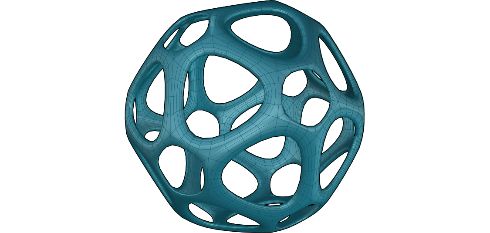
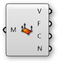

###2.1.4. Упражнение

#####В этом разделе мы проработаем простое упражнение, взяв примитивы Element* за основу. Мы внедрим half-edge структуру данных, а также используем обе характеристики компонентов трансформации (uniform и per vertex)


>Файлы упражнения, которые сопровождают этот раздел: [http://grasshopperprimer.com/appendix/A-2/1_gh-files.html](http://grasshopperprimer.com/appendix/A-2/1_gh-files.html)

>Файлы упражнения, которые сопровождают этот раздел: [Download](../../appendix/A-2/gh-files/2.1_element addon.gh)


||||
|--|--|--|
|01.| Запустите новое определение, набрав Ctrl+N (в Grasshopper)||
|02.| Зайдите в **Element\*/Primitive/Icosohedron** - перетащите компонент **Icosohedron** на холст||
|03.| Зайдите в **Params/Input/Number Slider** - перетащите компонент **Number Slider** на холст||
|04.| Подключите **Number Slider** к входу Radius (R) в компоненте **Icosohedron**||
|05.| Дважды кликните по **Number Slider** и установите подходящие значения. В этом примере мы использовали: <ul>Name: Radius (Радиус) Rounding: Integer Lower Limit: 5 Upper Limit: 50 Value: 25</ul> ||
|06.| Зайдите в **Element\*/Data/Face Neighbors** - перетащите компонент **Face Neighbors** на холст| |
|07.| Соедините выход Mesh (M) компонента **Icosohedron** с входом Mesh (M) компонента **Face Neighbors**.|||

>Посмотрев на данные выхода Neighboring Face Edges (NE), мы видим дерево и 20 ветками, где каждая ветка содержит три линии. 20 веток каждая представляет полигон икосаэдра, у которого 20 сторон, в то время как три линии - это ребра каждого триангулированного полигона.

||||
|--|--|--|
|08.| Зайдите в **Params/Input/Number Slider** - вытащите компонент **Number Slider** на холст и установите следующие значения: <ul>Rounding: Float Lower Limit:0 Upper Limit: 0.5</ul>||
|09.| Зайдите **Params/Input/Panel** - вытащите компонент **Panel** на холст||
|10.| Дважды кликните по **Panel** и введите "1" в текстовое поле||
|11.| Зайдите в **Math/Operators/Subtraction** - перетащите компонент **Subtraction** на холст||
|12.| Соедините **Panel** с значением "1" с входом A, соедините слайдер с входом B компонента **Subtraction**||
|13.| Зайдите в **Sets/Tree/Merge** - вытащите компонент **Merge** на холст||
|14.| Соедините **Number Slider** с входом D1 компонента **Merge**, соедините выход R компонента **Subtraction** с входом D2 компонента **Merge**||
|15.| Зайдите **Curve/Analysis/Evaluate Curve** - вытащите компонент **Evaluate Curve** на холст|
|16.| Соедините выход Face Edges (NE) компонента **Face Neighbors** с входом Curve (C) компонента **Evaluate Curve**||
|17.| Кликните правой клавишей по входу Curve (C) компонента **Evaluate Curve** и выберите Graft. Это создаст новую ветку для каждого ребра.||
|18.| Соедините выход Result (R) компонента **Merge** с входом Parameter (t) компонента **Evaluate Curve** Из-за того, что мы сделали graft с входом Curve, каждое ребро определяется по обоим параметрам компонента **Merge**|||

||||
|--|--|--|
|19.| Зайдите в **Sets/Tree/Trim Tree** - вытащите компонент **Trim Tree** на холст||
|20.| Соедините выход Points (P) компонента **Evaluate Curve** с входом Tree (T) компонента **Trim Tree**.  <blockquote>Значение входа Depth (D) по умолчанию для **Trim Tree** равно 1. Это сокращает глубину нашего дерева данных на один уровень путем смешения внешних веток. В результате у нас получается 20 веток, каждая с шестью точками. </blockquote>||
|21.| Зайдите в **Curve/Spline/Polyline** - перетащите компонент **Polyline** на холст||
|22.| Соедините выход Tree (T) компонента **Trim Tree** с входом Vertices (V) компонента **Polyline**||
|23.| Кликните правой клавишей мыши по входу Closed (C) компонента **Polyline**, кликните по "Set Boolean" и выберите значение True  <blockquote>Так мы создали закрытую полилинию из шести сторон для каждого исходного полигона mesh.</blockquote>||
|24.| Зайдите в **Element\*/Transform/Mesh Frame** - перетащите компонент **Mesh Frame** на холст.|
|25.| Соедините выход Polyline (Pl) компонента **Polyline** с входом Geometry (G) компонента **Mesh Frame**  <blockquote>Заметьте, что компонент **Mesh Frame** ** может принимать в качестве входа как mesh так и список закрытых полилиний кривых</blockquote>||
|26.| Зайдите в **Params/Input/Number Slider** - вытащите компонент **Number Silder** на холст. Мы будем использовать по умолчанию диапазон от 0 до 1 для этого слайдера||
|27.| Подключите **Number Slider** к входу Factor (F) компонента **Mesh Frame**|||

||||
|--|--|--|
|28.| Зайдите в **Element\*/Utility/Mesh Combine and Clean** - перетащите компонент **Mesh Combine and Clean** на холст||
|29.| Соедините выход Mesh (M) компонента **Mesh Frames** с входом Mesh (M) компонента **Mesh Combine and Clean**||
|30.| Кликните правой клавишей мыши по входу Mesh (M) компонента **Mesh Combine and Clean** и выберите Flatten  <blockquote>Применяя Flatten для дерева mesh, **Combine and Clean** будет смешивать все 20 полигонов mesh в одну mesh</blockquote>||
|31.| Зайдите в **Element\*/Transform/Mesh Thicken** - перетащите компонент **Mesh Thicken** на холст||
|32.| Соедините выход Mesh (M) компонента **Combine and Clean** с входом Mesh (M) компонента **Mesh Thicken**||
|33.| Зайдите в **Element\*/Subdivide/Catmull Clark Subdivision** - перетащите компонент **Catmull Clark Subdivision** на холст|
|34.| Соедините выход Mesh (M) компонента **Mesh Thicken** с входом Mesh (M) компонента **Catmull Clark Subdivision**|||

>Мы срезали верхушку триангулированных полигонов исходной mesh, тем самым также создали кольца вокруг каждой исходной вершины. Мы также создали рамку для каждого полигона, затем утолщили mesh и детализировали ее с помощью подразделения. Далее мы используем преимущество Per Vertex для трансформации компонентов, используя аттрактор.

||||
|--|--|--|
|35.| Зайдите в **Params/Geometry/Point** - перетащите параметр **Point** на холст||
|36.| Кликните правой клавишей мыши по параметру **Point** и кликните по "Set on point" выберите точку в видовом окне Rhino  <blockquote>Подсказка - вы также можете создать точку прямо в Grasshopper дважды кликнув по холсту, чтобы появилось окно Поиска, затем указать координаты точки, такие как "10,10,0" (без кавычек)</blockquote>||
|37.| Зайдите в **Mesh/Analysis/Deconstruct Mesh** - перетащите компонент **Deconstruct Mesh** на холст||
|38.| Соедините выход Mesh (M) компонента **Combine and Clean** с входом Mesh (M) компонента **Deconstruct Mesh**.  <blockquote>Это для того, чтобы извлечь вершины нашей объединенной mesh, а затем применить аттрактор к этим вершинам</blockquote>||
|39.| Зайдите в **Vector/Point/Distance** - перетащите компонент **Distance** на холст||
|40.| Соедините выход Vertices (V) компонента **Deconstruct Mesh** с входом A компонента **Distance**||
|41.| Соедините компонент **Point** с входом B компонента **Distance**||
|42.| Соедините выход Distance (D) компонента **Distance** с входом PerVectex Data (VD) компонента **Thicken**||
|43.| Зайдите в **Params/Input/Number Slider** - вытащите два слайдера **Number Slider** на холст. Мы будем использовать их для установки нижней и верхней границ для компонента **Mesh Thicken**||
|44.| Дважды кликните по **Number Sliders** слайдеру и установите значения. В этом примере, мы оставим у первого слайдера значения по умолчанию, а у второго слайдера установим верхнюю границу на 5.0||
|45.| Зайдите в **Maths/Domain/Construct Domain** - перетащите компонент **Construct Domain** на холст|
|46.| Соедините два слайдера с входами А и В компонента **Construct Domain**||
|47.| Соедините выход Domain (I) компонента **Construct Domain** с входом Min and Max Values (D) компонента **Mesh Thicken**.||
|48.| Кликните правой клавишей мыши по входу Type (T) компонента **Thicken**, выберите "Set Integer" и введите значение 1  <blockquote>Вы также можете включить PerVertex данные, используя компонент **Boolean Toggle** установленный на  True.</blockquote>|||

---

