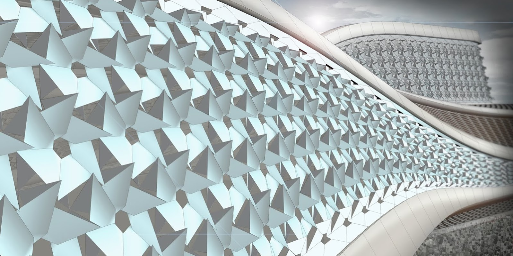
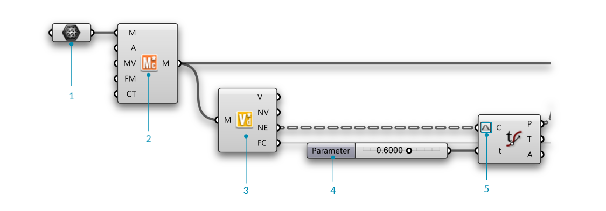

###2.1.5. Element* Изучение применения в архитектуре

#####В этом разделе мы проработает простой пример, в качестве введения в работу с инструментами Element. Мы изучим некоторые паттерны и обработку фасадов в области архитектуры, где мы подключим структуру данных Half Edge вместе с базовыми компонентами Element без использования характеристик per vertex.

####2.1.5.1 Пример 1


>Файлы упражнения, которые сопровождают этот раздел: [http://grasshopperprimer.com/appendix/A-2/1_gh-files.html](http://grasshopperprimer.com/appendix/A-2/1_gh-files.html)

>Файлы упражнения, которые сопровождают этот раздел: [Download](../../appendix/A-2/gh-files/2.1.5.1_Architecture Case Study_A.gh)


---

---

||||
|--|--|--|
|00.| Создайте плоскость mesh в Rhino с **XFaces = 2 и YFaces = 2** и запустите новое определение, набрав Ctrl-N (в Grasshopper)||
|01.| Зайдите в **Params/Geometry/Mesh** - вытащите контейнер **Mesh** на холст||
|01b.| Чтобы привязать mesh в Rhino, кликните правой клавишей мыши по компоненту **Mesh** и выберите "Set one Mesh".  <blockquote>Мы будем использовать простую плоскость mesh в ходе работы с этим определением, но вы можете заменить эту mesh вашей собственной</blockquote>||
|02.| Зайдите в **Element\*/Utility/Mesh Combine and Clean** - перетащите компонент **Element* Mesh Combine and Clean** на холст||
|03.| Зайдите в **Element\*/Data/Vertex Neighbors** - перетащите компонент **Element* Vertex Neighbors** на холст| |
|04.| Зайдите в **Params/Input/Number Slider** - перетащите компонент **Number Slider** на холст и установите следующие значения: <ul>Lower Limit: 0.0000 Upper Limit: 1.0000</ul>||
|05.| Зайдите в **Curve/Analysis/Evaluate Curve** - перетащите компонент **Evaluate Curve** на холст||
|05b.| Соедините выход Neighbouring Edges (NE) компонента **Element* Vertex Neighbors** с входом Curve (C) компонента **Evaluate Curve**||
|05c.| Соедините слайдер **Number Slider** с входом Float (t) компонента **Evaluate Curve** и установите значение на 0.5000||
|05d.| Кликните правой клавишей по входу Curve (C) компонента **Evaluate Curve** и выберите **Reparameterize** |||

---

||||
|--|--|--|
|06.| Зайдите в **Element\*/Analyse/Mesh Closest Point** - перетащите компонент **Element* Mesh Closest Point** на холст||
|06a.| Соедините выход Mesh (M) компонента **Element\*/Utility/Mesh Combine and Clean** с входом Mesh (M) компонента **Element* Mesh Closest Point**||
|06b.| Соедините выход Points (P) компонента **Curve/Analysis/Evaluate Curve** с входом Point (P) компонента **Element* Mesh Closest Point**||
|07.| Зайдите в **Params/Input/Number Slider** - вытащите компонент **Number Slider** на холст и установите следующие значения: <ul>Rounding: Float Lower Limit:0 Upper Limit: 10.000</ul>||
|08.| Зайдите в **Vector/Vector/Amplitude** - перетащите компонент **Amplitude** на холст||
|09.| Зайдите в **Transform/Euclidean/Move** - перетащите компонент **Move** на холст||
|10.| Зайдите в **Params/Geometry/Point** - перетащите компонент **Point** на холст||
|10b.| Соедините выход Face Centers (FC) компонента **Element* Vertex Neighbors** с компонентом **Point**||
|11.| Зайдите в **Sets/List/Weave** - перетащите компонент **Weave** на холст|||

---

||||
|--|--|--|
|12.| Зайдите в **Curve/Primitive/Polyline** - перетащите компонент **Polyline** на холст||
|12b.| Соедините выход Weave (W) компонента **Weave** с входом Vertices (V) компонента **Polyline**||
|12c.| Кликните правой клавишей мыши по входу Closed (C) компонента **Polyline**, кликните по "Set Boolean" и выберите значение True  <blockquote>Так мы создали закрытую полилинию.</blockquote>||
|13.| Зайдите в **Params/Input/Number Slider** - перетащите компонент **Number Silder** на холст. Мы будем использовать по умолчанию диапазон от 0 до 1 для этого слайдера.||
|14.| Зайдите в **Element\*/Transform/Mesh Frame** - перетащите компонент **Element* Mesh Frame** на холст.||
|14b.| Соедините выход Polyline (Pl) компонента **Polyline** с входом Geometry (G) компонента **Mesh Frame**  <blockquote>Заметьте, что компонент **Mesh Frame** может принимать в качестве входа как mesh, так и список закрытых полилиний кривых</blockquote>||
|14c.| Подключите слайдер **Number Slider** к входу Factor (F) компонента **Mesh Frame**|||

---

||||
|--|--|--|
|15.| Зайдите в **Element\*/Utility/Mesh Combine and Clean** - перетащите компонент **Element* Mesh Combine and Clean** на холст| |
|15b.| Кликните правой клавишей мыши по входу Combine Type (CT) компонента **Element* Mesh Combine and Clean**, кликните по "Set Integer" и установите значение 1.  <blockquote>Вход Combine Type имеет две опции (0, которая объединяет и очищает mesh) и (1, которая соединяет mesh в список и не смешивает вершины). IВ этом примере мы хотим соединить mesh  </blockquote>||
|16.| Кликните правой клавишей мыши по входу Mesh (M) компонента **Element* Mesh Combine and Clean** и выберите "Flatten".  <blockquote>После этого мы сможем соединить список mesh.</blockquote>||
|17.| Зайдите в **Element\*/Utility/Mesh Status** - перетащите компонент **Element* Mesh Status** на холст| |
|17b| Соедините выходы Info (I) и Status (S) компонента **Element* Mesh Status** с компонентом **Params/Input/Panel**  <blockquote>Выход mesh **Info** содержит информацию о правильности mesh, закрытом или открытом типе и о количестве компонентов mesh (вершины, полигоны, нормали). **Status** mesh информирует пользователя о том, в "хорошем" ли состоянии mesh, а также передает данные о неоднородных ребрах, количестве неиспользованных вершин, количестве неправильных полигонов, количестве naked ребер и количестве необъединенных mesh. </blockquote>||
|18.| Зайдите в **Params/Input/Colour Swatch** - перетащите компонент **Colour Swatch** на холст||
|19.| Зайдите в **Display/Preview/Custom Preview** - перетащите компонент **Custom Preview** на холст|||

---

---

####2.1.5.2 Пример 2


>Файлы упражнения, которые сопровождают этот раздел: [http://grasshopperprimer.com/appendix/A-2/1_gh-files.html](http://grasshopperprimer.com/appendix/A-2/1_gh-files.html)

>Файлы упражнения, которые сопровождают этот раздел: [Download](../../appendix/A-2/gh-files/2.1.5.2_Architecture Case Study_B.gh)


---

---
||||
|--|--|--|
|00.| Создайте плоскость mesh в Rhino с **XFaces = 2 и YFaces = 2** и запустите новое определение, набрав Ctrl-N (в Grasshopper)||
|01.| Зайдите в **Params/Geometry/Mesh** - перетащите компонент **Mesh** на холст||
|01b.| Чтобы привязать mesh в Rhino, кликните правой клавишей мыши по компоненту **Mesh** и выберите "Set one Mesh".  <blockquote>Мы будем использовать простую плоскость mesh в ходе работы с этим определением, но вы можете заменить эту mesh вашей собственной</blockquote>||
|02.| Зайдите в **Element\*/Utility/Mesh Combine and Clean** - перетащите компонент **Element* Mesh Combine and Clean** на холст||
|03.| Зайдите в **Element\*/Data/Vertex Neighbors** - перетащите компонент **Element* Vertex Neighbors** на холст| |
|04.| Зайдите в **Vector/Vector/Vector2Pt** - перетащите компонент **Vector2Pt** на холст||
|05.| Зайдите в **Params/Input/Number Slider** - перетащите компонент **Number Slider** на холст и установите следующие значения: <ul>Rounding: Float Lower Limit:0 Upper Limit: 2.000</ul>||
|06.| Зайдите в **Maths/Operator/Multiplication** - перетащите компонент **Multiplication** на холст||
|07.| Зайдите в **Maths/Operators/Addition** - перетащите два компонента **Addition** на холст||
|08.| Зайдите в **Curve/Primitive/Polyline** - перетащите компонент **Polyline** на холст||
|09.| Зайдите в **Curve/Primitive/Polyline** - перетащите компонент **Polyline** на холст|||

---
||||
|--|--|--|
|10.| Зайдите в **Params/Input/Number Slider** - перетащите компонент **Number Slider** на холст и установите следующие значения: <ul>Rounding: Float Lower Limit:0 Upper Limit: 1.000</ul>||
|11,12.| Зайдите в **Element\*/Transform/Mesh Frame** - перетащите компонент **Element* Mesh Frame** на холст.||
|11b,12b.| Соедините выход Polyline (Pl) компонента **Polyline** с входом Geometry (G) компонента **Mesh Frame**  <blockquote>Заметьте, что компонент **Mesh Frame** может принимать в качестве входа как mesh, так и список закрытых полилиний кривых</blockquote>||
|11c,12c.| Подключите **Number Slider (10)** к входу Factor (F) компонента **Mesh Frame**||
|13,14.| Зайдите в **Element\*/Subdivide/Catmull Clark Subdivision** - перетащите компонент **Catmull Clark Subdivision** на холст  <blockquote> Мы установим значение входа Iterations (I) на 1, также как и значение входа **Edge Condition** (E) на 1. Опции входа edge condition следующие 0 = Общая фиксация, 1 == Сглаживание, 2 == Фиксация Углов.  </blockquote>||
|15.| Зайдите в **Sets/Tree/Merge** - вытащите два компонента **Merge** на холст||
|15b.| Right click the Result (R) output of the **Merge** component and click "Flatten". ||
|16.| Зайдите в **Element\*/Utility/Mesh Combine and Clean** - перетащите компонент **Element* Mesh Combine and Clean** на холст|||

>У компонентов имеются подробные замечания и предупреждения, информирующие пользователя о текущих или возможных проблемах, которые могут возникнуть после итерации с другими компонентами. В некоторых случаях вы можете использовать компонент Element* Combine and Clean чтобы объединить одинаковые вершины на mesh, что может привести к неоднородным ребрам, если в дальнейшем mesh будет утолщена. Компонент Element* Combine and Clean проинформирует вас об этом моменте и о том, что он вернет список обратно. У вас есть возможность установить Combine Type на значение 1, которое объединит mesh в список, но не объединит идентичные вершины.

---

||||
|--|--|--|
|17.| Зайдите в **Element\*/Utility/Mesh Edges** - перетащите компонент **Element* Mesh Edges** на холст| |
|17b| Соедините выход Mesh (M) компонента **Element* Mesh Combine and Clean** (16) с входом Mesh (M) компонента **Element* Mesh Edges** ||
|18.| Зайдите в **Params/Input/Number Slider** - перетащите компонент **Number Slider** на холст и установите следующие значения: <ul>Rounding: Float Lower Limit:0 Upper Limit: 1.000</ul>||
|19.| Зайдите в **Element\*/Transform/Mesh Frame** - перетащите компонент **Element* Mesh Frame** на холст.||
|19b| Соедините выход Face Polylines (FP) компонента **Element* Mesh Edges** с входом Mesh (M) компонента **Element* Mesh Frame** ||
|19c| Подключите **Number Slider** к входу Float (f) компонента **Element* Mesh Frame** ||
|20.| Зайдите в **Element\*/Utility/Mesh Combine and Clean** - перетащите компонент **Element* Mesh Combine and Clean** на холст||
|21.| Кликните правой клавишей мыши по входу Mesh (M) компонента **Element* Mesh Combine and Clean** и выберите "Flatten". ||
|22.| Кликните правой клавишей мыши по входу Combine Type (CT) компонента **Element* Mesh Combine and Clean**, кликните по "Set Integer" и установите значение 1.  <blockquote>Вход Combine Type имеет две опции (0, которая объединяет и очищает mesh) и (1, которая соединяет mesh в список, но не совмещает вершины). В этом примере мы хотим соединить несколько mesh  </blockquote>||
|23.| Зайдите в **Params/Input/Colour Swatch** - перетащите компонент **Colour Swatch** на холст||
|24.| Зайдите в **Display/Preview/Custom Preview** - перетащите компонент **Custom Preview** на холст||
|25.| Зайдите в **Element\*/Utility/Mesh Status** - перетащите компонент **Element* Mesh Status** на холст| |
|25b| Соедините выходы Info (I) и Status (S) компонента **Element* Mesh Status** с компонентом **Params/Input/Panel**  <blockquote>Выход mesh **Info** содержит информацию о правильности mesh, закрытом или открытом типе и о количестве компонентов mesh (вершины, полигоны, нормали). **Status** mesh информирует пользователя о том, в "хорошем" ли состоянии Mesh, а также передает данные о неоднородных ребрах, количестве неиспользованных вершин, количестве неправильных полигонов, количестве naked ребер и количестве необъединенных mesh. </blockquote>|||

---

