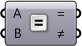
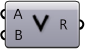
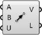
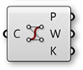

## 2.1. Индекс

#####Этот индекс содержит дополнительную информацию по всем компонентам, использованным в этом пособии, а также другие компоненты, которые могут оказаться вам полезными. Это небольшое введение в более чем 500 компонентов в плагине Grasshopper.

Параметры
--

####Geometry
||||
|--|--|--|
|P.G.Crv|Curve Parameter Представляет набор геометрии Curve (кривая). Геометрия Curve - это общий знаменатель всех типов кривых в Grasshopper.||
|P.G.Circle|Circle Parameter Представляет набор примитивов Circle (круг).||
|P.G.Geo|Geometry Parameter Представляет набор 3D геометрии.||
|P.G.Pipeline|Geometry Pipeline Определяет геометрию pipeline из Rhino в Grasshopper.||
|P.G.Pt|Point Parameter Параметр Point (точка) способен хранить постоянные данные. Вы можете настроить запись постоянных данных через меню Parameter.||
|P.G.Srf|Surface Parameter Представляет набор геометрии Surface (поверхность). Surface геометрия - это общий знаменатель всех типов поверхности в Grasshopper.||

####Primitive
||||
|--|--|--|
|P.P.Bool|Boolean Parameter Представляет набор Булевых значений (Правда/Ложь).||
|P.P.D|Domain Parameter Представляет набор одно-пространственных Диапазонов. Диапазоны обычно используются для представления фрагментов кривых и длительных числовых диапазонов. Диапазон состоит из двух чисел, которые показывают ограничения диапазона, все, что между этими числами является частью диапазона.||
|P.P.D2|Domain2 Parameter Содержит набор двух-пространственных диапазонов. 2D диапазоны обычно используются для представления фрагментов поверхности. Двух-пространственный диапазон состоит из двух одно-пространственных диапазонов.||
|P.P.ID|Guid Parameter Представляет набор Globally Unique Identifiers (глобально уникальных идентификаторов). Параметры Guid способны хранить постоянные данные. Вы можете настроить запись постоянных данных через меню Parameter.||
|P.P.Int|Integer Parameter Представляет набор Integer (целых) численных значений. Параметры Integers способны хранить постоянные данные. Вы можете настроить запись постоянных данных через меню Parameter.||
|P.P.Num|Number Parameter Представляет набор численных значений с плавающей точкой. Параметры Number способны хранить постоянные данные. Вы можете настроить запись постоянных данных через меню Parameter.||
|P.P.Path|File Path Содержит набор путей файла.||

####Input
||||
|--|--|--|
|P.I.Toggle|Boolean Toggle Переключатель булевых значений (правда/ложь).||
|P.I.Button|Button<brКнопка с двумя значениями. При нажатии, кнопка возвращает значение true (правда) и затем сбрасывает значение на false (ложь).||
|P.I.Swatch|Color Swatch Swatch (образец) - это особый объект интерфейса, который позволяет быстро настроить индивидуальные цветовые значения. Вы можете поменять цвет образца через контекстное меню.||
|P.I.Grad|Gradient Control Gradient control (контроль градиента) позволяет определить градиент цвета внутри числового диапазона. По умолчанию используется диапазон (от 0.0 до 1.0), но это можно настроить через параметры ввода L0 и L1. Также вы можете добавить цветовые ползунки к градиенту перетаскивая из верхнего левого угла цветовое колесико и настраивая цветовые ползунки кликая правой клавишей мыши.||
|P.I.Graph|Graph Mapper Graph Mapper позволяет вам перенести набор чисел. По умолчанию диапазоны {x} и {y} графической функции - это диапазон секции (0.0 ~ 1.0), но это также можно настроить через Graph Editor. Graph Mapper может содержать одиночную функцию переноса, которую можно выбрать через контекстное меню. Графы обычно имеют ползунки (небольшие круги), которые можно использовать для изменения переменных, которые определяют графическое уравнение. По умолчанию, объекты graph mapper не содержат графиков и выполняют перенос значений 1:1.||
|P.I.Slider|Number Slider Slider (слайдер) - это особый объект интерфейса, который позволяет быстро настроить индивидуальные числовые значения. Вы можете менять значения и характеристики через меню или двойным кликом на поверхности слайдера. Слайдеры можно удлинить или укоротить перетаскивая самое крайнее правое ребро влево или вправо. Заметьте, что слайдеры имеют только вход (т.е. не имеют выхода).||
|P.I.Panel|Panel Panel (панель) для разных заметок и текстовых значений. Обычно, это неактивный объект, который позволяет вам добавлять комментарии или объяснения к Документу. Панели могут получать информацию откуда угодно. Если вы подключите параметр выхода в панель, вы увидите содержание этого параметра в реальном времени. Все данные в Grasshopper можно просматривать таким образом. Панели также могут передавать их содержание в текстовый файл.||
|P.I.List|Value List Предоставляет список преднастроенных значений из которых можно выбрать.||

####Utilities
||||
|--|--|--|
|P.U.Cin|Cluster Input Представляет параметр Cluster Input.||
|P.U.COut|Cluster Output Представляет параметр Cluster Output.||
|P.U.Dam|Data Dam Задерживает данные на их пути по всему документу.||
|P.U.Jump|Jump Прыжок между различными местами.||
|P.U.Viewer|Param Viewer Просмотрщик структуры данных.||
|P.U.Scribble|Scribble Быстрая заметка.||

Maths
--

####Domain
||||
|--|--|--|
|M.D.Bnd|Bounds Создает числовой диапазон, который содержит список чисел.||
|M.D.Consec|Consecutive Domains Создает последовательные диапазоны из списка чисел.||
|M.D.Dom|Construct Domain Создает числовой диапазон из двух числовых экстремум.||
|M.D.Dom2Num|Construct Domain² Создает двух-пространственный диапазон из четырех чисел.||
|M.D.DeDomain|Deconstruct Domain Разрушает числовой диапазон на его компоненты.||
|M.D.DeDom2Num|Deconstruct Domain² Разрушает двух-пространственный диапазон на четыре числа.||
|M.D.Divide|Divide Domain² Разделяет двух-пространственный диапазон на равные сегменты.||
|M.D.Inc|Includes Проверяет числовое значение, включено ли оно в диапазон.||
|M.D.ReMap|Remap Numbers Переносит числа в новый числовой диапазон.||

####Operators
||||
|--|--|--|
|M.O.Add|Addition Математическое добавление.||
|M.O.Div|Division Математическое разделение.||
|M.O.Equals|Equality Проверяет на (не)равенство двух чисел.||
|M.O.And|Gate And Выполняет соединение булевых значений (AND gate). Оба входа должны быть True, для того чтобы результат был True.||
|M.O.Not|Gate Not Выполняет отрицание булевых значений (NOT gate).||
|M.O.Or|Gate Or Выполняет разъединение булевых значений (OR gate). Только один вход должен быть True, для того чтобы результат был True||
|M.O.Larger|Larger Than Больше чем (или равно).||
|M.O.Multiply|Multiplication Математическое умножение.||
|M.O.Smaller|Smaller Than Меньше чем (или равно).||
|M.O.Similar|Similarity Проверяет на сходство двух чисел.||
|M.O.Sub|Subtraction Математическое извлечение.||

####Script
||||
|--|--|--|
|M.S.Eval|Evaluate Определяет выражение с гибкими числами переменных.||
|M.S.Expression|Expression Определяет выражение.||

####Trig
||||
|--|--|--|
|M.T.Cos|Cosine Вычисляет косинус значения.||
|M.T.Deg|Degrees Конвертирует угол, указанный в радианах, в градусы.||
|M.T.Rad|Radians Конвертирует угол, указанный в градусах, в радианы.||
|M.T.Sin|Sine Вычисляет синус значения.||

####Utilities
||||
|--|--|--|
|M.U.Avr|Average Проверяет среднее арифметическое для набора элементов.||
|M.U.Phi|Golden Ratio Выдает множество золотого сечения (Phi).||
|M.U.Pi|Pi Выдает множество Pi.||

Sets
--

####List
||||
|--|--|--|
|S.L.Combine|Combine Data Сочетает не-неизвестные значения из нескольких входов.||
|S.L.CrossRef|Cross Reference Производит кросс-референс данных из множества списков.||
|S.L.Dispatch|Dispatch Распаковывает элементы списка в два целевых списка. List Dispatching очень похоже на компонент [Cull Pattern], за исключением того, что оба списка предоставляются как выходы.||
|S.L.Ins|Insert Items Вставляет коллекцию элементов в список.||
|S.L.Item|List Item Извлекает особые элементы из списка.||
|S.L.Lng|List Length Измеряет длину списка. Элементы списка идентифицируются по их индексу. Первый элемент сохраняется под индексом ноль, второй элемент под индексом один и так далее. Самый большой возможный индекс в списке равняется длине списка минус один.||
|S.L.Long|Longest List Выращивает набор списков по самому длинному среди них.||
|S.L.Split|Split List Разделяет лист на отдельные части.||
|S.L.Replace|Replace Items Заменяет определенные элементы в списке.||
|S.L.Rev|Reverse List Разворачивает порядок списка. Новый индекс каждого элемента будет N-i, где N - наивысший индекс в списке и i - старый индекс элемента.||
|S.L.Shift|Shift List Смещает все элементы в списке. Элементы в списке смещаются (перемещаются) к концу списка, если shift смещение имеет положительное значение. Если Wrap равняется True, тогда те элементы, которые выпадают за края, присоединяются заново.||
|S.L.Short|Shortest List Сжимает коллекцию списков по длине самого короткого из них.||
|S.L.Sift|Sift Pattern Sift элементы в списке используют повторяющийся паттерн индексов.||
|S.L.Sort|Sort List Сортирует список числовых ключей. Чтобы что-то отсортировать, это должно быть сначала сопоставлено. Большинство типов данных не может быть сопоставлена, Numbers и Strings - единственное исключение. Если вы хотите отсортировать другие типы данных, такие как кривые, сначала вам потребуется создать список ключей.||
|S.L.Weave|Weave Соединяет набор вводных данных используя определенный шаблон. Шаблон определяется как список индекс значений (целых), которые определяют порядок, в котором вводные данные собираются.||

####Sets
||||
|--|--|--|
|S.S.Culli|Cull Index Cull (удаляет) проиндексированные элементы в списке.||
|S.S.Cull|Cull Pattern Cull (удаляет) элементы в списке, используя повторяющуюся битовую маску. Битовая маска определяется как список булевых значений. Битовая маска повторяется, пока все элементы из списка данных не будут определены.||
|S.S.Dup|Duplicate Data Дублировать данные предопределенное количество раз. Данные могут дублироваться двумя способами, либо копии списка прикрепляются в конце до тех пор, пока не будет достигнуто некое количество копий, либо каждый элемент дублируется некоторое число раз, прежде чем перейти к следующему элементу.||
|S.S.Jitter|Jitter Случайным образом перемешивает список значений. Вводный список реорганизуется на основе флуктуационного шума. Jittering (создание быстрых флуктуаций) - это хороший способ получения случайного набора с хорошим распределением. Параметры jitter (создания быстрых флуктуаций) настраивают радиус флуктуационного шума. Если jitter равняется 0.5, тогда каждому элементу разрешено переместиться случайным образом в пределах половины ширины всего набора.||
|S.S.Random|Random Генерируется список псевдо-случайных чисел. Числовая последовательность уникальна, но стабильная для каждого значения seed. Если вам не нравится случайное распределение, попробуйте другие значения seed.||
|S.S.Range|Range Создает диапазон чисел. Числа распределяются равномерно внутри числового диапазона. Используйте этот компонент, если вам необходимо создать числа между экстремумами. Если вы хотите контролировать интервалы между последовательными числами, вам следует использовать компонент [Series].||
|S.S.Repeat|Repeat Data Повторяет паттерн до тех пор, пока не достигнет определенной длины.||
|S.S.Series|Series Создает последовательность чисел. Числа распределены в соответствии со значением {Step}. Если вам необходимо распределить числа внутри фиксированного числового порядка, то используйте компонент [Range].||

####Tree
||||
|--|--|--|
|S.T.Explode|Explode Tree Извлекает все ветки из дерева.||
|S.T.Flatten|Flatten Tree Сглаживает дерево данных путем удаления всей информации о ветках.||
|S.T.Flip|Flip Matrix Переворот дерева данных типа матрицы меняя местами ряды и колонны.||
|S.T.Graft|Graft Tree Обычно, элементы данных хранятся в ветках в определенных индекс значениях (0 - первый элемент, 1 - второй элемент и т.д.) и ветки хранятся в деревьях в определенных путях веток, например: {0;1}, который отображает вторую под-ветку первой основной ветки. Grafting создает новую ветку для каждого отдельного элемента данных.||
|S.T.Merge|Merge Смешивает множество потоков данных.||
|S.T.Path|Path Mapper Выполняет лексические операции с деревьями данных. Лексические операции - это логические переносы между путями данных и индексов, которые определяются текстовыми (лексическими) масками и паттернами.||
|S.T.Prune|Prune Tree Удаляет все ветки у дерева, которое содержит определенное число элементов данных. Вы можете установить обе границы, нижнюю и верхнюю, при сокращении веток.||
|S.T.Simplify|Simplify Tree Упрощает дерево, удаляя накладки среди всех веток.||
|S.T.TStat|Tree Statistics Можно получить некоторую статистику касательно дерева данных.||
|S.T.Unflatten|Unflatten Tree Разглаживает дерево данных путем перемещения элементов обратно на ветки.||

Vector
--

####Grid
||||
|--|--|--|
|V.G.HexGrid|Hexagonal 2D сетка с шестиугольными ячейками.||
|V.G.RecGrid|Rectangular 2D сетка с прямоугольными ячейками.||
|V.G.SqGrid|Square 2D сетка с квадратными ячейками||

####Point
||||
|--|--|--|
|V.P.Pt|Construct Point Построение точки из координат {xyz}.||
|V.P.pDecon|Deconstruct Разбирает точку на ее компоненты.||
|V.P.Dist|Distance Вычисляет Евклидовое расстояние между координатами двух точек.||

####Vector
||||
|--|--|--|
|V.V.X|Unit X Unit вектор параллелен мировой оси {x}.||
|V.V.Y|Unit Y Unit вектор параллелен мировой оси {y}.||
|V.V.Vec2Pt|Vector 2Pt Создает вектор между двумя точками.||

Curve
--

####Analysis
||||
|--|--|--|
|C.A.CP|Control Points Извлекает контрольные точки nurbs и узлы кривой.||

####Division
||||
|--|--|--|
|C.D.Divide|Divide Curve Разделяет кривую на равные по длине сегменты.||

####Primitive
||||
|--|--|--|
|C.P.Cir|Circle Создает круг, определяемый основной плоскостью и радиусом.||
|C.P.Cir3Pt|Circle 3Pt Создает круг, определяемый тремя точками.||
|C.P.CirCNR|Circle CNR Создает круг, определяемый центром, нормалью и радиусом.||
|C.P.Line|Line SDL Создает линейный сегмент, определяемый начальной точкой, тангенсом и длиной.||
|C.P.Polygon|Polygon Создает полигон с дополнительными круглыми ребрами.||

####Spline
||||
|--|--|--|
|C.S.IntCrv|Interpolate Создает интерполируемую кривую через набор точек.||
|C.S.KinkCrv|Kinky Curve Строит интерполируемую кривую через набор точек с предельной величиной угла изгиба.||
|C.S.Nurbs|Nurbs Curve Строит кривую nurbs из контрольных точек.||
|C.S.PLine|PolyLine Создает полилинию, соединяющую некоторое число точек.||

####Util
||||
|--|--|--|
|C.U.Explode|Explode Разбивает кривую на маленькие сегменты.||
|<C.U.Join|Join Curves Соединяет так много кривых как возможно.||
|C.U.Offset|Offset Смещает кривую на определенную дистанцию.||

Surface
--

####Analysis
||||
|--|--|--|
|S.A.DeBrep|Deconstruct Brep Разбирает brep на ее составляющие.||

####Freeform
||||
|--|--|--|
|S.F.Boundary|Boundary Surfaces Создает плоскую поверхность из коллекции граничных ребер кривых.||
|S.F.Extr|Extrude Вытесняет кривые и поверхности вдоль вектора.||
|S.F.ExtrPt|Extrude Point Вытесняет кривые и поверхности к точке.||
|S.F.Loft|Loft Создает выпуклую поверхность через набор секций кривых.||
|S.F.RevSrf|Revolution Создает поверхность вращения.||
|S.F.Swp2|Sweep2 Создает загнутую поверхность с двумя rail кривыми.||

####Primitive
||||
|--|--|--|
|S.P.BBox|Bounding Box Solve ориентированная геометрия граничных прямоугольников.||

####Util
||||
|--|--|--|
|S.U.SDivide|Divide Surface Генерирует сетку точек {uv} на поверхности.||
|S.U.SubSrf|Isotrim Извлекает изопараметрическое подмножество поверхности.||

Mesh
--

####Triangulation
||||
|--|--|--|
|M.T.Voronoi|Voronoi Плоскостная диаграмма Вороного для коллекции точек.||

Transform
--

####Affine
||||
|--|--|--|
|T.A.RecMap|Rectangle Mapping Трансформирует геометрию из одного прямоугольника в другой.||

####Array
||||
|--|--|--|
|T.A.ArrLinear|Linear Array Создает линейный массив геометрии.||

####Morph
||||
|--|--|--|
|T.M.Morph|Box Morph Превращение объекта в скрученную коробку.||
|T.M.SBox|Surface Box Создает скрученную коробку на участке поверхности.||

Display
--

####Color
||||
|--|--|--|
|D.C.HSL|Colour HSL Создает цвет из плавающих точек {HSL} каналов.||

####Dimensions
||||
|--|--|--|
|D.D.Tag|Text tags Компонент текстовый тэг позволяет рисовать небольшие Strings в видовом окне как элементы обратной связи. Текст и расположение определяются как параметры ввода. Когда текстовые тэги запекаются, они превращаются в Text Dots (текстовые точки).||
|D.D.Tag3D|Text Tag 3D Представляет список 3D текстовых тэгов в видовом окне Rhino||

####Preview
||||
|--|--|--|
|D.P.Preview|Custom Preview Позволяет настраивать предпросмотр геометрии.||

####Vector
||||
|--|--|--|
|D.V.Points|Point List Отображает подробные данные о списках точек.||

