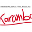

## 2.3. Ресурсы

##### Существует множество ресурсов доступных для дальнейшего изучения Grasshopper и концептов параметрического проектирования. Также существует больше сотни плагинов и аддонов, которые расширяют функциональность Grasshopper. Ниже некоторые наши любимые ресурсы.

### Сообщества по плагинам

food4Rhino (WIP) ) - это новое сообщество с плагинами, созданное McNeel. Как пользователь, вы найдете новейшие плагины для Rhino, аддоны для Grasshopper,Textures и Backgrounds. Добавляйте ваши комментарии, обсуждайте новые инструменты, связывайтесь с разработчиками этих приложений, делитесь своими скриптами.
http://www.food4rhino.com/

Страница аддонов Grasshopper
http://www.grasshopper3d.com/page/addons-forgrasshopper
 
### Аддоны, которые мы любим

DIVA-for-Rhino позволяет пользователям выполнять оценку экологическое воздействие индивидуальных строений и городского ландшафта.
http://diva4rhino.com/

Element это плагин mesh геомерии для Grasshopper, позволяющий создавать mesh, анализировать, изменять, подразделять и сглаживать.
http://www.food4rhino.com/project/element

Firefly предоставляет всеобъемлющий комплект ПО инструментов, направленный на создание связи между Grasshopper и микро-контроллером Arduino.
http://fireflyexperiments.com

GhPython - это интерпретирующий компонент Python для Grasshopper, который позволяет выполнять динамические скрипты любого типа. В отличие от других скриптовых компонентов, GhPython позволяет использовать rhynoscriptsyntax, чтобы начать писать скрипт без необходимости быть программистом.
http://www.food4rhino.com/project/ghpython

HAL это плагин Grasshopper для программирования промышленных роботов, поддерживающих ABB, KUKA и Universal Robots.
http://hal.thibaultschwartz.com/

Расширяет возможности Grasshopper для создания и привязывания к геометрии, включая свет, блоки и текстовые объекты. Также обеспечивает доступ к информации об активном документе Rhino, касающейся материалов, слоев, типов линий и других настроек.
http://www.food4rhino.com/project/human

Karamba это интерактивная программа, параметрических конечных элементов. Она позволяет проанализировать реакцию 3-пространственной балки и оболочки под произвольными нагрузками.
http://www.karamba3d.com/

Kangaroo это движок Live Physics для интерактивной симуляции, оптимизации и нахождения формы прямо из Grasshopper.
http://www.food4rhino.com/project/kangaroo

Fold panels используют изогнутое сгибание и распространение контрольной панели на поверхности с порядком системы аттракторов.
http://www.food4rhino.com/project/robofoldkingkong

LunchBox плагин для Grasshopper для исследования математических форм, панелизации, структуры и организации рабочего процесса.
http://www.food4rhino.com/project/lunchbox

Meshedit это набор компонентов, которые расширяют возможности Grasshopper в работе с mesh.
http://www.food4rhino.com/project/meshedittools

Параметрические инструменты для создания и использования прямоугольных сеток, аттракторов и поддержки креативного преобразования параметрических шаблонов.
http://www.food4rhino.com/project/pt-gh

Platypus позволяет авторам Grasshopper передавать геометрию в веб пространство в реальном времени. Он работает как чат-комната для параметрической геометрии и позволяет немедленно делать мэшап 3D модели в браузере.
http://www.food4rhino.com/project/platypus

TT Toolbox представляет набор различных инструментов, которые мы используем на регулярной основе из Core Studio у Thornton Tomasetti. Надеемся, что вы оцените это приложение.
http://www.food4rhino.com/project/tttoolbox

Weaverbirdтопологический моделер, который содержит много из известных подразделений и изменяемых операторов, с легкостью используется дизайнерами. Этот плагин реконструирует форму, разделяет любую mesh, состоящую даже из полилиний, и помогающую подготовить ее к производству.
http://www.giuliopiacentino.com/weaverbird/

### Дополнительные пособия
**The Firefly Primer**
Эта книга направлена на обучение основам электроники (использование Ардуино), а так же различным цифровым/ физическим техникам прототипирования для специалистов новых в этой сфере. Это не всеобъемлющая книга по электронике (так как уже написано много великолепных книг посвященных это теме). Вместо этого, эта книга сфокусирована на ускорении процесса прототипирования. Автор - Andrew Payne.
http://fireflyexperiments.com/resources/

**Essential Mathematics**
Essential Mathematics использует Grasshopper для объяснения проектировщикам основных положений математических идей, необходимых для эффективного развития вычислительных методов 3D моделирования и компьютерной графики. Автор - Rajaa Issa.
http://www.rhino3d.com/download/rhino/5.0/EssentialMathematicsThirdEdition/

**Generative Algorithms**
Серия книг, которые нацелены на развитие различных концептов в области Генеративных Алгоритмов и Параметрического Проектирования. Автор - Zubin Khabazi.
http://www.morphogenesism.com/media.html

**Rhino Python Primer**
Это пособие направлено на обучение программированию абсолютных новичков, людей, которые немного пробовали себя в программировании или экспертов-программистов, ищущих быстрое введение в методологию Rhino. Автор - Skylar Tibbits.
http://www.rhino3d.com/download/IronPython/5.0/RhinoPython101

### Общие ссылки
**Wolfram MathWorld** математический онлайн ресурс, организованный Эриком В. Вайсштайном при помощи нескольких тысяч участников. С тех пор, как первый контент появился онлайн в 1995 MathWorld превратился в связующее звено математической информации между математическим и образовательным сообществами. Данные этого ресурса широко используются в журналах и книгах на всех уровнях образования.
http://mathworld.wolfram.com/

### Дальнейшее чтение
Burry, Jane, and Mark Burry. *The New Mathematics of Architecture.* London: Thames & Hudson, 2010.

Burry, Mark. *Scripting Cultures: Architectural Design and Programming.* Chichester, UK: Wiley, 2011.

Hensel, Michael, Achim Menges, and Michael Weinstock. *Emergent Technologies and Design: Towards a Biological Paradigm for Architecture.* Oxon: Routledge, 2010.

Jabi, Wassim. *Parametric Design for Architecture.* Laurence King, 2013.

Menges, Achim, and Sean Ahlquist. *Computational Design Thinking.* Chichester, UK: John Wiley & Sons, 2011.

Menges, Achim. *Material Computation: Higher Integration in Morphogenetic Design.* Hoboken, NJ: Wiley, 2012.

Peters, Brady, and Xavier De Kestelier. *Computation Works: The Building of Algorithmic Thought.* Wiley, 2013.

Peters, Brady. *Inside Smartgeometry: Expanding the Architectural Possibilities of Computational Design.* Chichester: Wiley, 2013.

Pottmann, Helmut, and Daril Bentley. *Architectural Geometry.* Exton, PA: Bentley Institute, 2007.

Sakamoto, Tomoko, and Albert Ferré. *From Control to Design: Parametric/algorithmic Architecture.* Barcelona: Actar-D, 2008.

Woodbury, Robert. *Elements of Parametric Design.* London: Routledge, 2010.
