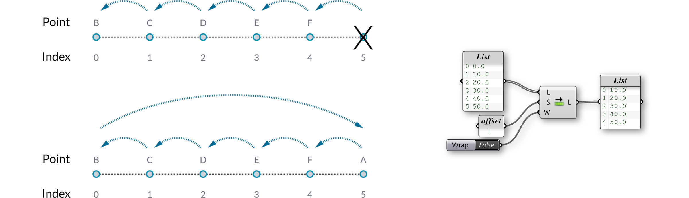

### 1.4.6. List Management

>Example files that accompany this section: [http://grasshopperprimer.com/appendix/A-2/1_gh-files.html](http://grasshopperprimer.com/appendix/A-2/1_gh-files.html)

>Example files that accompany this section: [Download](../../appendix/A-2/gh-files/1.4.6_list management.gh)


#####One of the most powerful features of Grasshopper is the ability to quickly build and manipulate various lists of data. We can store many different types of data in a list (numbers, points, vectors, curves, surfaces, breps, etc.) and there are a number of useful tools found under the Sets/List subcategory.

####1.4.6.1. LIST LENGTH
The List Length component (Sets/List/List Length) essentially measures the length of the List. Because our lists always start at zero, the highest possible index in a list equals the length of the list minus one. In this example, we have connected our base List to the List Length-L input, showing that there are 6 values in the list.

####1.4.6.2. LIST ITEM
Our List is fed into a List Item component (Sets/List/List Item) in order to retrieve a specific data item from within a data set. When accessing individual items in a list, we have to specify the i-input; which corresponds to the index number we would like to retrieve. We can feed a single integer or a list of integers into the i-input depending on how many items we would like to retrieve.The L-input defines the base list which we will be analyzing. In this example, we have set the i-input to 2 so the List Item component returns the data item associated with the 3rd entry number in our list.

####1.4.6.3. REVERSE LIST
We can invert the order of our list by using a Reverse List component (Sets/List/Reverse). If we input an ascending list of numbers from 0.0 to 50.0 into the Reverse List component; the output returns a descending list from 50.0 to 0.0.

####1.4.6.4. SHIFT LIST
The Shift List component (Sets/Sequence/Shift List) will either move the list up or down a number of increments depending on the value of the shift offset. We have connected the List output into the Shift-L input, while also connecting a number to the Shift-S input. If we set the offset to -1, all values of the list will move down by one entry number. Likewise, if we change the offset to +1, all values of the list will move up by one entry number. If Wrap input equals True, then items that fall off the ends are re-appended to the beginning or end of the list. In this example, we have a shift offset value set to +1, so that our list moves
up by one entry number. Now, we have a decision to make on how we would like to treat the first value. If we set the Wrap value to False, the first entry will be shifted up and out of the list, essentially removing this value from the data set (so, the list length is one less than it was before). However, if we set the wrap value to True, the first entry will be moved to the bottom of the list

####1.4.6.5. INSERT ITEMS
The Insert Items component (Sets/Lists/Insert Items) enables you to insert a collection of items into a list. In order for this to work properly, you need to know the items you want to insert and the index position for each new item. In the example below, we will insert the letters A, B, and C into index position three.

####1.4.6.6. WEAVE
The Weave component (Sets/Lists/Weave) merges two or more lists together
based on a specified weave pattern (P input).When the pattern and the streams do not match perfectly, this component can either insert nulls into the output streams or it can ignore streams which have already been depleted.

####1.4.6.7. CULL PATTERN
The Cull component (Sets/Sequence/Cull Pattern) removes elements in a list using a repeating bit mask. The bit mask is defined as a list of Boolean (true or false) values. The bit mask is repeated until all elements in the data list have been evaluated.

