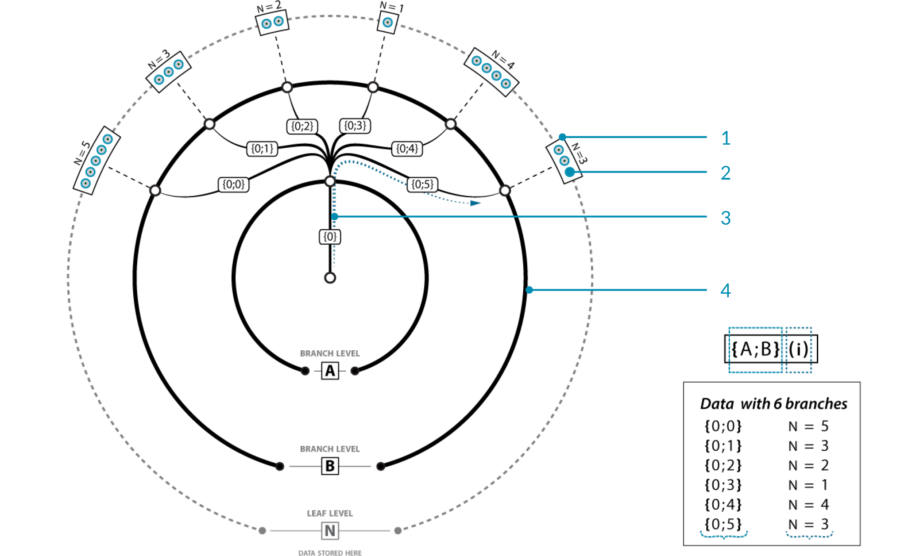

### 1.5.2. What is a Data Tree?

#####A Data Tree is a hierarchical structure for storing data in nested lists. Data trees are created when a grasshopper component is structured to take in a data set and output multiple sets of data. Grasshopper handles this new data by nesting it in the form of sub-lists. These nested sub-lists work in the same way as folder structures on your computer in that accessing indexed items require moving through paths that are informed by their generation of parent lists and their own sub-index.

It’s possible to have multiple lists of data inside a single parameter. Since multiple lists are available, there needs to be a way to identify each individual list. A Data Tree is essentially a list of lists, or sometimes a list of lists of lists (and so on).

In the image above, there is a single master branch (you could call this a trunk, but since it’s possible to have multiple master branches, it might be a bit of a misnomer) at path {0}. This path contains no data, but does have 6 sub-branches. Each of these sub-branches inherit the index of the parent branch {0} and add their own sub-index (0, 1, 2, 3, 4, and 5 respectively). It would be wrong to call this an “index”, because that implies just a single number. It is probably better to refer to this as a “path”, since it resembles a folder-structure on the disk. At each of these sub-branches, we encounter some data. Each data item is thus part of
one (and only one) branch in the tree, and each item has an index that specifies its location within the branch. Each branch has a path that specifies its location within the tree.

The image below illustrates the difference between a list and a data tree. On the left, an array of four columns of six points each is all contained in one list. The first column numbered 0-5, the second 6-11, and so on. On the right is the same array of points contained in a data tree. The data tree is a list of four columns, and each column is a list of six points. The index of each point is (column number, row number). This is a much more useful way of organizing this data, because you can easily access and operate on all the points in a given row or column, delete every second row of points, connect alternating points, etc.

####1.5.2.1. DATA TREE VISUALIZATION

>Example files that accompany this section: [http://grasshopperprimer.com/appendix/A-2/1_gh-files.html](http://grasshopperprimer.com/appendix/A-2/1_gh-files.html)

>Example files that accompany this section: [Download](../../appendix/A-2/gh-files/1.5.2.1_data tree visualization.gh)


Due to their complexity, Data Trees can be difficult to understand. Grasshopper has several tools to help visualize and understand the data stored in a tree.

**The Param Viewer**
The Param Viewer (Params/Util/Param Viewer) allows you to visualize data in text form and as a tree. Connect any output containing data to the input of the Param Viewer. To show the tree, right-click the Param Viewer and select “draw tree.” In this example, the Param Viewer is connected to the Points (P) output of a Divide Curve component that divided 10 curves into 10 segements each. The ten branches correspond to the ten curves, each containing a list of 11 points which are the division points of the curve.

>1. Path of each list
2. Number of items in each list
3. Select "Draw Tree" to display the data tree

If we connect a panel to the same output, it displays ten lists of 11 items each. You can see that each item is a point defined by three coordinates. The path is displayed at the top of each list, and corresponds to the paths listed in the Param Viewer.

>1. Path
2. List of 11 items

**Tree Statistics**
The Tree Statistics component (Sets/Tree/Tree Statistics) Returns some
statistics of the Data Tree including:
* P - All the paths of the tree
* L - The length of each branch in the tree
* C - Number of paths and branches in the tree

If we connect the Points output of the same Divide Curve component, we can display the paths, lengths, and the count in panels. This component is helpful because it separates the statistics into three outputs, allowing you to view only the one that is relevant.

Both the Param Viewer and the Tree Statistics component are helpful for visualizing changes in the structure of the Data Tree. In the next section, we will look at some operations that can be performed to change this structure.
