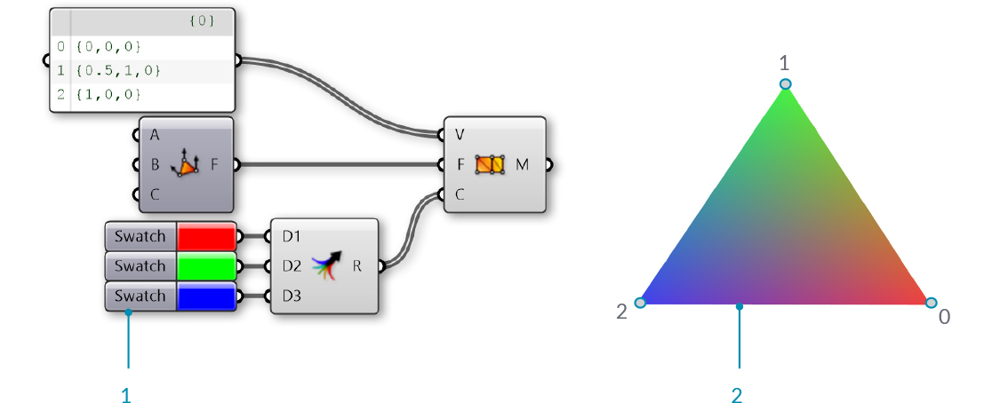

### 1.6.1 什么是网格？

#####网格（mesh）是用来构建曲面或者实体几何的四边形和三角形的集合。这一节讨论网格对象的结构，包括顶点、边缘和面，以及网格的附加属性例如颜色与法线。

>1. 网格顶点
2. 网格边缘
3. 网格面

####1.6.1.1 网格的基本组成

Grasshopper以面—顶点数据结构定义网格。从根本上说，这一结构只是一些点的集合，点被分组以构成多边形。网格的点被称为*顶点（vertex）*，而多边形则被称为*面（face）*。若要创建一个网格，我们需要一个顶点的列表，和一套把这些顶点分组构成面的体系。

>1. 顶点的列表
2. 面与顶点的分组

**顶点**

网格顶点只是一个点的列表。回忆一下，Grasshopper中的*列表*是对象的集合。列表中的每个对象都有一个*索引*，用来描述对象在列表中的位置。顶点的索引对于构建网格和获取网格结构的信息至关重要。

>1. 点的列表。Grasshopper的所有列表都从索引0作为开始
2. 一组标有索引的点

**面**

一个面是3个或4个顶点的有序列表。所以，网格面的“曲面”表达取决于被索引的顶点的位置。我们已经有了构成网格的顶点的列表，因此无需通过具体的点来定义面，而只需利用顶点的索引。这使我们可以在不止一个面中使用同一个顶点。

>1. 由索引0、1、2、3组成的四角面
2. 由索引1、4、2组成的三角面

在Grasshopper中，面可以用**Mesh Triangle**和**Mesh Quad**运算器来创建。这些运算器的输入端是整型，对应于我们想用来构建面的顶点的索引。连接**Panel**到这些运算器的输入端，我们可以看到，一个三角面以T{A;B;C}表示，四角面用Q{A;B;C;D}的形式表示。大于四个边的面是不合法的。若想要创建五边网格元素，这个网格一定要拆分成两个以上的面。

>1. **Mesh Quad**运算器与索引0、1、2和3
2. **Mesh Triangle**运算器与索引1、4和2

一定要记住，这些运算器不会创建网格几何，它们的输出只是一个索引的列表，用来定义网格是如何构建的。遵照这个列表的格式，我们可以编辑**Panel**运算器，输入三角或四角面应有的格式来手动创建面。

>1. 用**Mesh Quad** 运算器创建的面
2. 用**Panel**创建的面
3. 缩小视图并双击面板，或者右键点击面板然后选择“Edit Notes...”，即可打开面板属性窗口

我们现在已有一个顶点的列表和一套面的定义，但仍未创建出网格。为创建网格，需要用**Construct Mesh**运算器把面和顶点联系起来。我们把索引列表连接到输入端V，把合并后的面列表连接到输入端F。（运算器上还有一个可选的颜色输入端，我们将在下面讨论。）如果我们把一个面板连接到**Construct Mesh**的输出端，我们就可以看到面和顶点的数量信息。

>1. **Construct Mesh**运算器将顶点的列表和面的列表作为输入。颜色输入是可选的，暂时空出
2. 面板显示，我们创建了一个有5个顶点和2个面的网格
3. 生成的网格（顶点标有它们的索引）

默认情况下，Grasshopper不会预览网格几何的边缘。若要同时预览边缘和面，你可以利用快捷键Ctrl+M开启网格边缘预览，或者进入Display菜单，选择“Preview Mesh Edges”。

构建网格面时一定要注意索引的顺序。面是按找列表顺序连接顶点构建出来的，所以四角面Q{0,1,2,3}与Q{1,0,2,3}有着很大区别，尽管它们的四个顶点是相同的。错误的索引排序会导致诸如漏洞、非流形网格几何或者不可定向曲面等问题。这样的网格几何通常无法正确地渲染，也不能3D打印。这些问题将在《理解拓扑》一节进一步详细地讨论。

>1. 索引0、1、2、3构成的四角面
2. 索引0、3、1、2构成的四角面

####1.6.1.2 非精确网格数据

除了面和顶点，我们还会使用到网格的另一些信息。在基于面—顶点的网格中，*边缘*和*法线*这样的数据是根据已知的面和顶点大致计算出来的。这一节介绍调用这些信息的方法。

**边缘**

网格的*边缘（edge）*是在一个面中连接两个连续顶点的线。要注意，一些边缘是被多个面共用的，而其他的边缘只依附于一个面。一条边缘依附的面的数量被称为这条边缘的*价*。

Grasshopper把边缘按照价数分成三类：

1. E1 — “裸边缘”只有1价。它们构成了网格的边界。
2. E2 — “内边缘”有2价。
3. E3 — “非流形边缘”有3个或3个以上价。包含这种结构的网格被称为“非流形”，下一节会对此进行讨论。

>1. 1价裸边缘
2. 2价内边缘
3. 3价非流形边缘

我们可以用**Mesh Edges**运算器获取指定价数的边缘。这使我们能够定位构成网格边界的边缘，或识别出非流形边缘。但有时，获取面的边界更有用。为此，我们可以使用**Face Boundaries**运算器。它会为每个面返回一条多段线。

>1. **Mesh Edges**运算器输出三组边缘。这个网格有5个裸边缘、1个内边缘和0个非流形边缘
2. 输出端E3是空的，因为这个网格不包含非流形边缘，输出的线是橙色的
3. **Face Boundaries**运算器为每个面生成一条多段线

**面法线**

*法向量（normal vector）*是指方向垂直于曲面的向量。对于三角面，我们知道任意三点一定在同一平面上，所以法线一定垂直于这个平面，但是我们如何知道法线所指的（上下）方向呢？索引的顺序再次发挥作用。Grasshopper中的网格面以逆时针方向画出，所以面{0,1,2}“翻转”过来就是{1,0,2}。更直观的方法是*右手定则*。

>1. **Face Normals**运算器会返回面的中心点和法向量的列表
2. 索引顺序决定的面法线
3. “右手定则”决定法线方向

Grasshopper也允许四角面，但这种情况下4个顶点不一定在同一平面上。对于面来说，中心点就是4个顶点坐标的平均值（要注意，非平面四角面的中心点不一定在网格上）。为计算四角面的法线，我们需要先把面三角化，即拆分成两个三角面。整个面的法线就是两个三角面的法线的加权平均值，权重取决于两个三角面的面积。

**顶点法线**

除了面法线，网格上每个顶点的法线也是可以计算出来的。对于只用在一个面上的顶点，顶点法线的方向与面法线相同。如果顶点用在多个面上，则取各面的平均值。

尽管不如面法线直观，顶点法线却对网格的平滑表现极为重要。你可能注意到，即使网格由平面面组成，它在Rhino的着色模式下仍显得比较圆滑。这种平滑表现就是利用了顶点向量。

>1. 由面法线得出的法线使网格着色后呈不连续的多边形
2. 面法线取平均值得出顶点法线，使着色后的面交接更加平滑

####1.6.1.3 网格属性

网格的顶点和面可被赋予额外的属性。最简单的就是下面将会讲解的顶点颜色，其他的属性包括纹理UV坐标等。（某些程序甚至可以将顶点向量作为属性更改，而无需由面和顶点得出，使曲面的渲染表达更加灵活。）

**颜色**

使用**Construct Mesh**运算器时，输入端有一个可选的顶点颜色项。使用**Mesh Color**运算器可以给一个已有网格赋予颜色。连接一个单色给网格，即可给整个网格着色。

>三角网格分别着红、绿、蓝色

上述例子中的网格被着色时，其实每个顶点都被赋予颜色。若使用包含三个颜色的列表，我们可以分别赋予三角形的每个顶点不同的颜色。这些颜色会被应用在可视化中，每个面通过内插顶点颜色而渲染。比如，下图显示了顶点分别是红、绿和蓝色的三角面。

>1. 红、绿、蓝色分别被赋予给网格的三个顶点
2. 生成的网格内插顶点颜色

####1.6.1.4 练习

>配合这一节的实例文件：[http://grasshopperprimer.com/appendix/A-2/1_gh-files.html](http://grasshopperprimer.com/appendix/A-2/1_gh-files.html)

>配合这一节的实例文件：[Download](../../appendix/A-2/gh-files/1.6.1_what is a mesh.gh)


||||
|--|--|--|
|01.| 创建一个新定义，（在Grasshopper中）按Ctrl+N||
|02.| **Mesh/Primitive/Mesh Quad** — 把一个**Mesh Quad**运算器拖拽到画布上||
|03.| **Mesh/Primitive/Construct Mesh** — 把一个**Construct Mesh** 运算器拖拽到画布上|
|04.| 连接**Mesh Quad**运算器的输出端F与**Construct Mesh**运算器的输入端F|||

> **Mesh Quad**与**Construct Mesh**自带默认值，会创建一个网格面。接下来，我们会用我们自己的索引和面替换默认值。

||||
|--|--|--|
|05.| **Params/Input/Panel** — 把一个**Panel**运算器拖拽到画布上||
|06.| 双击**Panel**运算器并将其值设为0||
|07.| **Params/Input/Panel** — 再把四个**Panel**运算器拖拽到画布上并将它们的值设为1、2、3和4   <blockquote>你也可以按住Alt，点击并拖拽第一个**Panel**再释放以将其复制</blockquote>||
|08.| 把**Panels**按下面的顺序连接到**Mesh Quad**的输入端：<ul>0 - A 1 - B 2 - C 3 - D</ul>||
|09.| **Mesh/Primitive/Mesh Triangle** — 把一个**Mesh Triangle**运算器拖拽到画布上||
|10.| 把**Panels**按下面的顺序连接到**Mesh Triangle**的输入端：<ul>1 - A 2 - B 4 - C</ul>||
|11.| **Sets/Tree/Merge** — 把一个**Merge**运算器拖拽到画布上||
|12.| 把**Mesh Quad**运算器的输出端F连接到**Merge**运算器的输入端D1上，把**Mesh Triangle**运算器的输出端F连接到**Merge**运算器的输入端D2上||
|13.| 把**Merge**运算器的输出端R连接到**Construct Mesh**运算器的输入端F上|||

>**Construct Mesh**的默认顶点列表（V）只有4个点，但是我们的**Mesh Triangle**运算器会用到索引4，对应列表中的第五个点。由于默认的顶点不够，**Construct Mesh**运算器会报错。若要解决，我们要提供我们自定义的点列表。

||||
|--|--|--|
|14.| **Params/Input/Panel** — 把一个**Panel**运算器拖拽到画布上||
|15.| 右键点击**Panel**运算器并取消“Multiline Data”选项  <blockquote>面板默认情况开启“Multiline Data”。取消这个选项，面板中的每一行会被当作一个列表中的不同物件分别读取。</blockquote>||
|16.| 双击**Panel**运算器进行编辑，并输入下列各点： <ul>{0,0,0} {1,0,0} {1,1,0} {0,1,0} {2,0,0}</ul><blockquote>要确认你使用了正确的符号。若要在**Panel**中定义一个点，一定要使用花括号“{”和“}”，并用逗号分隔x、y和z值</blockquote>||
|17.| 把**Panel**运算器连接到**Construct Mesh**的输入端V上|||

>我们现在得到了一个有2个面和5个顶点的网格

或者，我们也可以把**Mesh Quad**和**Mesh Triangle**运算器替换成装有面的索引值的面板。

||||
|--|--|--|
|18.|**Params/Input/Panel** — 把一个**Panel**运算器拖拽到画板上||
|19.|右键点击**Panel**运算器并取消“Multiline Data”选项   <blockquote>或者复制已有的装有顶点坐标的**Panel**，它已经取消了“Multiline Data”</blockquote>||
|20.|双击**Panel**运算器进行编辑，并输入下列各点： <ul>Q{0,1,2,3} T{1,2,4}</ul>||
|21.|把**Panel**连接到**Construct Mesh**运算器的输入端F上|||

||||
|--|--|--|
|22.| **Params/Input/Colour Swatch** — 把一个**Colour Swatch**运算器拖拽到画板上||
|23.| 点击运算器的颜色部分（默认是白色）打开颜色选择面板||
|24.| 用滑块将G值和B值设为0。颜色被设为红色||
|25.| **Params/Input/Colour Swatch** — 再把两个**Colour Swatch**运算器拖拽到画板上并将它们的颜色设为蓝色和绿色||
|26.| **Sets/Tree/Merge** — 把一个**Merge**运算器拖拽到画板上||
|27.| 把3个**Color Swatch**运算器连接到**Merge**运算器的输入端D1、D2和D3上||
|28.| 把**Merge**运算器的输出端R连接到**Construct Mesh**运算器的输入端C上|||

>我们有5个顶点，但只有3个颜色。Grasshopper会重复分配颜色，也就是说，顶点0和3会变成红色，顶点1和4会变成绿色，最后的顶点2会变成蓝色。

